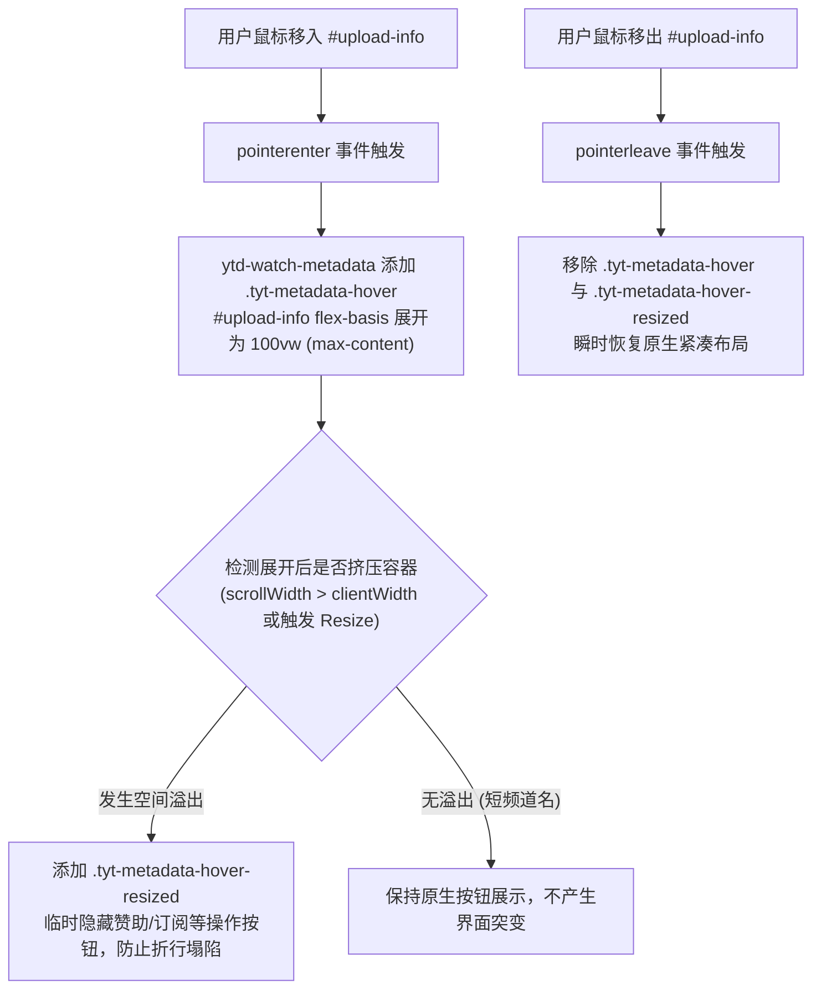
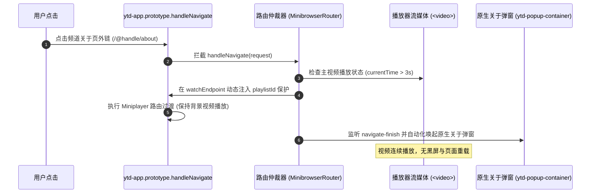

# 频道全名悬浮展开与微浏览器导航拦截架构方案

## 1. 方案概述

本方案针对 YouTube Turbo 用户脚本在视频详情页（Watch Page）中的两项核心交互增强特性进行系统化设计与落地：

1. **频道全名悬浮自适应展开机制（`fullChannelNameOnHover`）**：在右侧栏多标签布局下，主内容区宽度被压缩导致创作者频道名称被省略号（`...`）截断。本方案通过 CSS 扩展结合智能溢出检测，提供无换行、无跳动且不误伤短名称的悬浮展开体验；
2. **频道关于页微浏览器路由拦截与播放保活机制（`minibrowser` & `handleNavigate`）**：在 `ytd-app` 原型层拦截创作者关于页（`/@handle/about`、`/channel/UC.../about`）及带锚点评论（`&lc=`）的 SPA 导航，借助播放器 Miniplayer 状态保活与原生弹窗唤起，实现不中断视频播放的即时查看体验。

---

## 2. 模块一：频道全名悬浮自适应展开机制 (`fullChannelNameOnHover`)

### 2.1 第一性原理与交互设计



### 2.2 核心职责与架构集成

- **观察者统管**：所有尺寸监听统一接入 [`ObserverRegistry`](file:///e:/project/YouTube_Improvements/src/features/tabview/page/observer-registry.ts)（`roChannelHover`），严禁在组件内脱管创建 `ResizeObserver`；
- **挂载生命周期**：通过 [`PolymerPatcher`](file:///e:/project/YouTube_Improvements/src/features/tabview/page/polymer-patcher.ts) 的 `ytd-watch-metadata` 拦截通道及 [`NavigationCoordinator`](file:///e:/project/YouTube_Improvements/src/features/tabview/page/coordinator.ts) 的路由事件保障节点绑定与解绑。

### 2.3 核心实现契约 (`src/features/tabview/page/channel-hover-adapter.ts`)

```typescript
import { PAGE_CONSTANTS } from "./constants";
import { ObserverRegistry } from "./observer-registry";

export class ChannelHoverAdapter {
  private static instance: ChannelHoverAdapter | null = null;
  private currentUploadInfo: HTMLElement | null = null;
  private checkResizeDeadline: number = 0;
  private isBound: boolean = false;

  public static getInstance(): ChannelHoverAdapter {
    if (!ChannelHoverAdapter.instance) {
      ChannelHoverAdapter.instance = new ChannelHoverAdapter();
    }
    return ChannelHoverAdapter.instance;
  }

  public activate(): void {
    if (this.isBound) {
      return;
    }
    this.isBound = true;

    ObserverRegistry.getInstance().registerChannelHoverObserver((entries) => {
      if (Date.now() > this.checkResizeDeadline) {
        return;
      }
      for (let i = 0; i < entries.length; i++) {
        const target = entries[i].target as HTMLElement;
        if (target && entries[i].contentRect.width > 0) {
          const metadata = target.closest<HTMLElement>(PAGE_CONSTANTS.SELECTORS.WATCH_METADATA);
          if (metadata && metadata.classList.contains(PAGE_CONSTANTS.CLASSES.METADATA_HOVER)) {
            // 仅在实际超出可用容器宽度时隐藏操作按钮，防止折行
            const isOverflowing = target.scrollWidth > target.clientWidth + PAGE_CONSTANTS.HOVER.OVERFLOW_TOLERANCE_PX;
            if (isOverflowing) {
              metadata.classList.add(PAGE_CONSTANTS.CLASSES.METADATA_HOVER_RESIZED);
            }
          }
          break;
        }
      }
    });

    this.bindHoverEvents();
  }

  public onNavigateFinish(): void {
    this.bindHoverEvents();
  }

  public bindHoverEvents(): void {
    const uploadInfo = document.querySelector<HTMLElement>(PAGE_CONSTANTS.SELECTORS.UPLOAD_INFO);
    if (!uploadInfo || this.currentUploadInfo === uploadInfo) {
      return;
    }

    this.unbindCurrentEvents();
    this.currentUploadInfo = uploadInfo;

    const opt: AddEventListenerOptions = { passive: true, capture: false };
    uploadInfo.addEventListener("pointerenter", this.handleMouseEnter, opt);
    uploadInfo.addEventListener("pointerleave", this.handleMouseLeave, opt);

    ObserverRegistry.getInstance().observeChannelHover(uploadInfo);
  }

  private handleMouseEnter = (evt: Event): void => {
    const target = evt.currentTarget as HTMLElement | null;
    const metadata = target?.closest<HTMLElement>(PAGE_CONSTANTS.SELECTORS.WATCH_METADATA);
    if (metadata) {
      metadata.classList.remove(PAGE_CONSTANTS.CLASSES.METADATA_HOVER_RESIZED);
      this.checkResizeDeadline = Date.now() + PAGE_CONSTANTS.TIMEOUTS.HOVER_RESIZE_DEADLINE_MS;
      metadata.classList.add(PAGE_CONSTANTS.CLASSES.METADATA_HOVER);
    }
  };

  private handleMouseLeave = (evt: Event): void => {
    const target = evt.currentTarget as HTMLElement | null;
    const metadata = target?.closest<HTMLElement>(PAGE_CONSTANTS.SELECTORS.WATCH_METADATA);
    if (metadata) {
      metadata.classList.remove(PAGE_CONSTANTS.CLASSES.METADATA_HOVER_RESIZED);
      metadata.classList.remove(PAGE_CONSTANTS.CLASSES.METADATA_HOVER);
    }
  };

  private unbindCurrentEvents(): void {
    if (this.currentUploadInfo) {
      const opt: AddEventListenerOptions = { passive: true, capture: false };
      this.currentUploadInfo.removeEventListener("pointerenter", this.handleMouseEnter, opt);
      this.currentUploadInfo.removeEventListener("pointerleave", this.handleMouseLeave, opt);
      ObserverRegistry.getInstance().unobserveChannelHover(this.currentUploadInfo);
      this.currentUploadInfo = null;
    }
  }

  public destroy(): void {
    this.unbindCurrentEvents();
    ObserverRegistry.getInstance().clearChannelHoverObserver();
    this.isBound = false;
  }
}
```

---

## 3. 模块二：频道关于页微浏览器路由拦截与播放保活 (`minibrowser` & `handleNavigate`)

### 3.1 第一性原理与保活路由机制

在 YouTube SPA 架构下，点击频道关于链接（如 `/@creator/about`）默认会销毁当前的 `ytd-watch-flexy` 容器并触发全页导航，导致正在播放的视频中断。

本机制的核心在于：
1. **Miniplayer 状态保护注入**：当主视频正在播放（`currentTime > 3s` 且非暂停）时，在 `ytd-app` 的 `currentVideoEndpoint.watchEndpoint` 上动态定义临时的 `playlistId: "*"` 代理属性，使 YouTube Polymer 路由决策将当前播放器降级为后台 Miniplayer 保持流媒体传输；
2. **原生关于弹窗触发（`ChannelAboutModalPresenter`）**：路由匹配命中关于页后，在 `yt-navigate-finish` 触发时通过 YouTube 原生的弹窗控制器（`ytd-popup-container`）或卡片模型（`yt-description-preview-view-model`）直接唤起原生的频道关于详情弹窗，完全复用官方的数据通道与多语言视图；
3. **Linked Comment 锚点原地重排（`LinkedCommentRelocator`）**：当导航请求属于同一视频下的评论直达（`&lc=`）时，拦截全页重新请求，通过 Polymer 内部评论数据源交换将目标评论置顶展示，并更新浏览器地址历史。



### 3.2 强类型定义契约 (`src/features/tabview/page/types.ts`)

```typescript
export interface WebCommandMetadata {
  url?: string;
  webPageType?: string;
  rootVe?: number;
}

export interface WatchEndpoint {
  videoId?: string;
  playlistId?: string;
  index?: number;
  params?: string;
  playerParams?: string;
}

export interface BrowseEndpoint {
  browseId?: string;
  params?: string;
  canonicalBaseUrl?: string;
}

export interface NavigationEndpoint {
  commandMetadata?: {
    webCommandMetadata?: WebCommandMetadata;
  };
  watchEndpoint?: WatchEndpoint;
  browseEndpoint?: BrowseEndpoint;
  searchEndpoint?: Record<string, unknown>;
  urlEndpoint?: { url: string };
}

export interface AppNavigateRequest {
  command?: NavigationEndpoint;
  endpoint?: NavigationEndpoint;
  navigationEndpoint?: NavigationEndpoint;
}
```

### 3.3 核心实现规范 (`src/features/tabview/page/minibrowser-router.ts`)

```typescript
import { PAGE_CONSTANTS } from "./constants";
import { PolymerHelper } from "./polymer-helper";
import type { AppNavigateRequest, NavigationEndpoint, WatchEndpoint } from "./types";

export class MinibrowserRouter {
  private static instance: MinibrowserRouter | null = null;
  private navigationCounter: number = 0;
  private isLoadStartListened: boolean = false;

  public static getInstance(): MinibrowserRouter {
    if (!MinibrowserRouter.instance) {
      MinibrowserRouter.instance = new MinibrowserRouter();
    }
    return MinibrowserRouter.instance;
  }

  public createPatchedHandleNavigate(
    rawHandleNavigate: (req: AppNavigateRequest, ...args: unknown[]) => unknown
  ): (this: unknown, req: AppNavigateRequest, ...args: unknown[]) => unknown {
    const self = this;

    return function (this: unknown, req: AppNavigateRequest, ...args: unknown[]): unknown {
      if (self.navigationCounter > PAGE_CONSTANTS.MASKS.TOKEN_MASK) {
        self.navigationCounter = 0;
      }
      const token = ++self.navigationCounter;

      let targetEndpoint: NavigationEndpoint | null = null;
      if (self.isEligibleForMiniplayer(req)) {
        targetEndpoint = self.extractBrowsableEndpoint(req);
      }

      if (!targetEndpoint || !self.shouldKeepMiniPlayer()) {
        return rawHandleNavigate.apply(this, [req, ...args]);
      }

      self.applyPlaylistProtection();
      self.ensureLoadStartListener();

      const url = targetEndpoint.commandMetadata?.webCommandMetadata?.url || "";
      if (self.isChannelAboutUrl(url)) {
        self.scheduleChannelAboutPopup(token);
      }

      return rawHandleNavigate.apply(this, [req, ...args]);
    };
  }

  private isChannelAboutUrl(url: string): boolean {
    if (!url || !url.endsWith("/about")) {
      return false;
    }
    // 兼容 /channel/UC.../about、/@handle/about、/c/name/about、/user/name/about
    return (
      PAGE_CONSTANTS.PATTERNS.CHANNEL_ID_ABOUT.test(url) ||
      PAGE_CONSTANTS.PATTERNS.CHANNEL_HANDLE_ABOUT.test(url) ||
      PAGE_CONSTANTS.PATTERNS.CHANNEL_CUSTOM_ABOUT.test(url)
    );
  }

  private shouldKeepMiniPlayer(): boolean {
    const isBrowseSubtype = document.querySelector(PAGE_CONSTANTS.SELECTORS.BROWSE_WITH_SUBTYPE);
    if (isBrowseSubtype) {
      return true;
    }

    const moviePlayer = Array.from(document.querySelectorAll<HTMLElement>(PAGE_CONSTANTS.SELECTORS.MOVIE_PLAYER)).find(
      (el) => !el.closest(PAGE_CONSTANTS.SELECTORS.HIDDEN_CONTAINER)
    );

    if (moviePlayer) {
      const media = moviePlayer.querySelector<HTMLMediaElement>("video, audio");
      if (
        media &&
        media.currentTime > PAGE_CONSTANTS.THRESHOLDS.MINIPLAYER_MIN_TIME_SEC &&
        media.duration - media.currentTime > PAGE_CONSTANTS.THRESHOLDS.MINIPLAYER_MIN_TIME_SEC &&
        !media.paused
      ) {
        return true;
      }
    }
    return false;
  }

  private isEligibleForMiniplayer(req: AppNavigateRequest): boolean {
    const command = req?.command || req?.endpoint || req?.navigationEndpoint;
    if (!command) {
      return false;
    }

    const hasWatch = Boolean(command.commandMetadata?.webCommandMetadata && command.watchEndpoint);
    const hasBrowse = Boolean(command.commandMetadata?.webCommandMetadata && command.browseEndpoint);
    const hasSearch = Boolean(command.browseEndpoint || command.searchEndpoint);

    if (!hasWatch && !hasBrowse && !hasSearch) {
      return false;
    }

    return this.shouldKeepMiniPlayer();
  }

  private extractBrowsableEndpoint(req: AppNavigateRequest): NavigationEndpoint | null {
    const endpoint = req?.command || req?.endpoint || req?.navigationEndpoint;
    if (!endpoint) {
      return null;
    }

    const meta = endpoint.commandMetadata?.webCommandMetadata;
    if (meta?.url && meta.webPageType) {
      return endpoint;
    }

    return null;
  }

  private applyPlaylistProtection(): void {
    const ytdAppElm = document.querySelector(PAGE_CONSTANTS.SELECTORS.YTD_APP);
    const ytdAppCnt = PolymerHelper.insp(ytdAppElm);
    const watchEndpoint = ytdAppCnt?.data?.response?.currentVideoEndpoint?.watchEndpoint as
      | (WatchEndpoint & { playlistId?: string })
      | undefined;

    if (!watchEndpoint || "playlistId" in watchEndpoint) {
      return;
    }

    let accessCount = 0;
    const maxAccess = PAGE_CONSTANTS.THRESHOLDS.PLAYLIST_PROTECT_MAX_ACCESS;

    Object.defineProperty(watchEndpoint, "playlistId", {
      get(): string {
        accessCount++;
        if (accessCount >= maxAccess) {
          delete watchEndpoint.playlistId;
        }
        return "*";
      },
      set(value: string): void {
        delete watchEndpoint.playlistId;
        watchEndpoint.playlistId = value;
      },
      enumerable: false,
      configurable: true
    });

    const onPageTypeChanged = (): void => {
      delete watchEndpoint.playlistId;
      document.removeEventListener(PAGE_CONSTANTS.DOM_EVENTS.YT_PAGE_TYPE_CHANGED, onPageTypeChanged);
    };

    document.addEventListener(PAGE_CONSTANTS.DOM_EVENTS.YT_PAGE_TYPE_CHANGED, onPageTypeChanged, { once: true });
  }

  private ensureLoadStartListener(): void {
    if (this.isLoadStartListened) {
      return;
    }
    this.isLoadStartListened = true;

    document.addEventListener(
      "loadstart",
      (evt: Event) => {
        const targetMedia = evt.target as HTMLMediaElement | null;
        if (!targetMedia || (targetMedia.nodeName !== "VIDEO" && targetMedia.nodeName !== "AUDIO")) {
          return;
        }

        const mainVideos = Array.from(document.querySelectorAll<HTMLMediaElement>(".video-stream.html5-main-video"));
        for (let i = 0; i < mainVideos.length; i++) {
          const video = mainVideos[i];
          if (video !== targetMedia && !video.paused) {
            void video.pause();
          }
        }
      },
      true
    );
  }

  private scheduleChannelAboutPopup(token: number): void {
    const onNavigateFinish = (): void => {
      document.removeEventListener(PAGE_CONSTANTS.DOM_EVENTS.YT_NAVIGATE_FINISH, onNavigateFinish);
      if (token !== this.navigationCounter) {
        return;
      }

      window.setTimeout(() => {
        const previewModel = Array.from(
          document.querySelectorAll<HTMLElement>(PAGE_CONSTANTS.SELECTORS.DESCRIPTION_PREVIEW_VIEW_MODEL)
        ).find((el) => !el.closest(PAGE_CONSTANTS.SELECTORS.HIDDEN_CONTAINER));

        if (previewModel) {
          const aboutBtn = Array.from(previewModel.querySelectorAll<HTMLButtonElement>("button")).find(
            (b) => !b.closest(PAGE_CONSTANTS.SELECTORS.HIDDEN_CONTAINER) && (b.textContent || "").trim().length > 0
          );
          if (aboutBtn) {
            aboutBtn.click();
          }
        }
      }, PAGE_CONSTANTS.TIMEOUTS.ABOUT_POPUP_TRIGGER_MS);
    };

    document.addEventListener(PAGE_CONSTANTS.DOM_EVENTS.YT_NAVIGATE_FINISH, onNavigateFinish, { once: true });
  }
}
```

---

## 4. 架构集成与生命周期规范

### 4.1 挂载入口整合 (`src/features/tabview/page/polymer-patcher.ts`)

在 `PolymerPatcher` 统一的原型劫持体系中追加 `ytd-app` 的初始化拦截：

```typescript
// 在 PolymerPatcher 中统筹 ytd-app 原型拦截
private patchYtdApp(): void {
  customElements.whenDefined("ytd-app").then(() => {
    const ytdAppElm = document.querySelector("ytd-app");
    const ytdAppCnt = PolymerHelper.insp(ytdAppElm);
    if (!ytdAppCnt) return;

    const proto = ytdAppCnt.constructor.prototype as Record<string, unknown>;
    this.hookMethod(proto, "handleNavigate", (rawMethod) => {
      return MinibrowserRouter.getInstance().createPatchedHandleNavigate(rawMethod as AnyFunction);
    });
  });
}
```

### 4.2 观察者总线扩展 (`src/features/tabview/page/observer-registry.ts`)

```typescript
// ObserverRegistry 新增单例通道
private roChannelHover: ResizeObserver | null = null;

public registerChannelHoverObserver(callback: ResizeObserverCallback): void {
  if (this.roChannelHover) {
    this.roChannelHover.disconnect();
  }
  this.roChannelHover = new ResizeObserver(callback);
}

public observeChannelHover(element: HTMLElement): void {
  this.roChannelHover?.observe(element);
}

public unobserveChannelHover(element: HTMLElement): void {
  this.roChannelHover?.unobserve(element);
}

public clearChannelHoverObserver(): void {
  this.roChannelHover?.disconnect();
  this.roChannelHover = null;
}
```

---

## 5. 常量定义规范 (`src/features/tabview/page/constants.ts`)

```typescript
export const PAGE_CONSTANTS = {
  // ... 继承现有常量
  SELECTORS: {
    // ...
    UPLOAD_INFO: "#primary.ytd-watch-flexy ytd-watch-metadata #upload-info",
    WATCH_METADATA: "ytd-watch-metadata",
    MOVIE_PLAYER: "#movie_player",
    HIDDEN_CONTAINER: "[hidden]",
    BROWSE_WITH_SUBTYPE: "ytd-page-manager#page-manager > ytd-browse[page-subtype]",
    DESCRIPTION_PREVIEW_VIEW_MODEL: "yt-description-preview-view-model",
    YTD_APP: "ytd-app"
  },
  CLASSES: {
    // ...
    METADATA_HOVER: "tyt-metadata-hover",
    METADATA_HOVER_RESIZED: "tyt-metadata-hover-resized"
  },
  PATTERNS: {
    CHANNEL_ID_ABOUT: /\/channel\/UC[-_a-zA-Z0-9+=.]{22}\/about/,
    CHANNEL_HANDLE_ABOUT: /\/@[a-zA-Z0-9_.-]+\/about/,
    CHANNEL_CUSTOM_ABOUT: /\/(?:c|user)\/[a-zA-Z0-9_.-]+\/about/
  },
  THRESHOLDS: {
    MINIPLAYER_MIN_TIME_SEC: 3,
    PLAYLIST_PROTECT_MAX_ACCESS: 3
  },
  TIMEOUTS: {
    HOVER_RESIZE_DEADLINE_MS: 300,
    ABOUT_POPUP_TRIGGER_MS: 80
  },
  HOVER: {
    OVERFLOW_TOLERANCE_PX: 4
  }
} as const;
```

---

## 6. 验证与质量保证

1. **悬浮全名自适应展开验证**：
   - 长频道名（> 15 个字符）：鼠标悬浮后平滑展开为 `max-content` 全称，检测到溢出后自动隐藏右侧订阅/赞助按钮，无折行塌陷；鼠标移开瞬时恢复；
   - 短频道名（< 8 个字符）：鼠标悬浮展开全称，未发生容器溢出，右侧操作按钮保持可见，无闪烁；
2. **关于页微浏览器与保活验证**：
   - 在简介卡片中点击不同格式的关于链接（`/@handle/about`、`/channel/UC.../about`）；
   - 主视频保持连续流畅播放，不触发全页刷新；
   - 自动唤起原生的频道关于详情弹窗；
3. **类型与构建检查**：
   - 执行 `pnpm run check` $\rightarrow$ 0 错误、0 警告；
   - 执行 `pnpm run build` $\rightarrow$ `dist/youtube-turbo.user.js` 构建成功。

