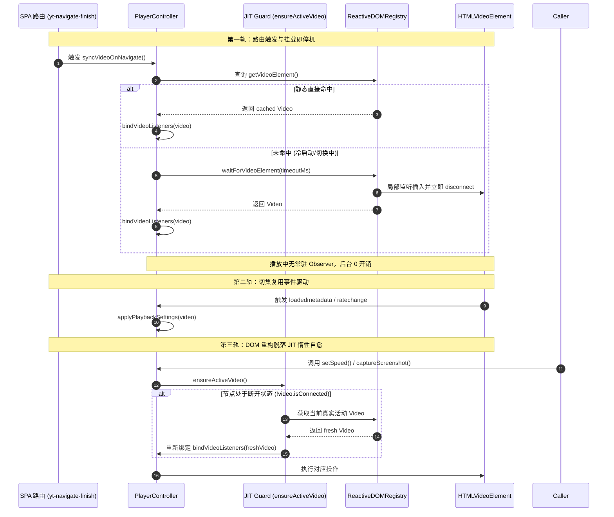
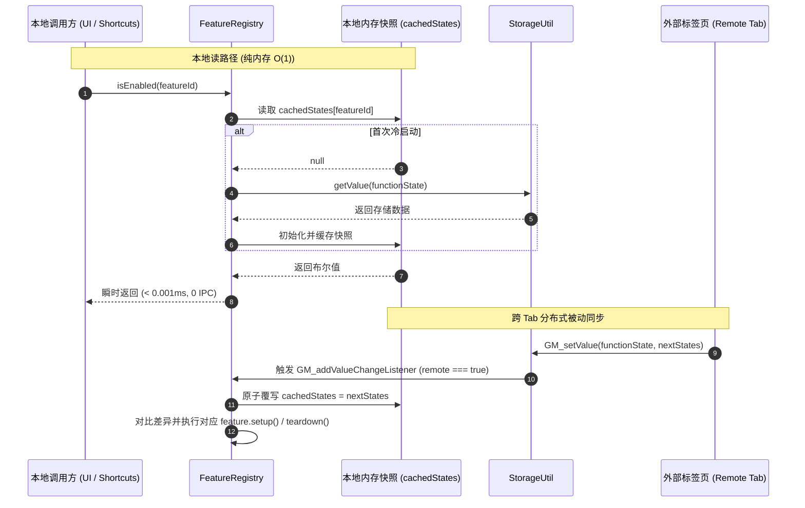

# 核心运行时与播放器第一优先级性能深化重构方案

## 1. 方案背景与设计原则

本方案基于 **codebase-design** 核心思想（Deep Modules、Interface 杠杆、Seam 精准安放、Locality 内聚与 Deletion Test），针对 YouTube Turbo 在运行时诊断中识别出的**第一优先级性能瓶颈与架构隐患**进行集中式深化与工业级落地设计。

第一优先级聚焦于**零侵入、高杠杆比、立竿见影消除后台主线程微任务空转、IPC 冗余与跨 Tab 状态漂移**的 4 大核心领域：
1. **播放器视频感知 Seam 重构（三轨制零开销自愈模型）**：终结 [`PlayerController`](../src/features/player/controller.ts) 对 `#movie_player` 的常驻全子树监听，实现严格的“挂载即停机”（Mount & Disconnect）与 JIT（Just-In-Time）惰性自愈；
2. **配置与功能状态内存只读快照化（跨 Tab 响应式同步）**：重构 [`FeatureRegistry`](../src/registry/feature-registry.ts) 与 [`StorageUtil`](../src/core/storage.ts) 接缝，将高频 `isEnabled` 查询从 `GM_getValue` 跨扩展 IPC 转化为纯内存 $O(1)$ 常数时间访问，并借助 `GM_addValueChangeListener` 实现多标签页最终一致性；
3. **样式引擎 CSSOM 存活与文本复合脏检查**：为 [`StyleEngine`](../src/core/style-engine.ts) 建立节点连接状态（`isConnected`）与文本快照双重脏检查，彻底消除重复注入触发的无效 CSSOM 重构、全页 Recalculate Style 与偶发节点脱落故障；
4. **死接缝清理与冗余抽象剔除（Deletion Test）**：基于 Deletion Test 准则，拔除 [`ReactiveDOMRegistry`](../src/core/dom-registry.ts) 与 [`PolymerHelper`](../src/features/tabview/page/polymer-helper.ts) 中零引用的历史残留死代码，精简打包体积并杜绝无边界全局全子树监听隐患。

---

## 2. 核心架构瓶颈诊断与深化方案

### 2.1 播放器视频感知 Seam 重构（`PlayerController`）

#### 瓶颈诊断
在 [`PlayerController.setupObserver()`](../src/features/player/controller.ts) 中，初始化后会在播放器容器上挂载永久性的 MutationObserver：
```typescript
this.observer.observe(container, {
  childList: true,
  subtree: true
});
```
- **微任务风暴**：在 YouTube 视频播放期间，控制栏浮现、音量滑块变动、进度缓冲刷新、弹幕与预览缩略图等会高频产生 DOM 变动；
- **无效轮询开销**：`subtree: true` 导致播放器内部每一次属性或子节点变动均触发回调，每次微任务都在重复调用 `ReactiveDOMRegistry.getInstance().getVideoElement()`；
- **脱落节点事件盲区**：在 YouTube 复杂 SPA 路由或错误重载时，播放器可能直接在 DOM 树中移除旧 `<video>` 节点并插入新节点。已脱落的节点无法接收任何 DOM 事件，单纯依赖节点自身的 `emptied` 或 `abort` 会导致系统陷入孤儿状态（Orphaned State）。

#### 深度重构设计：三轨制零开销自愈模型（Tri-Track Perception & Self-Healing）
1. **第一轨：主动感知与挂载即停机（Mount-and-Disconnect Gate）**：
   - 仅在 SPA 路由导航（`yt-navigate-finish`）或播放器初始化阶段，调用 `syncVideoOnNavigate()`；
   - 若 DOM 中已存在活动 video，立即完成绑定；若未就绪，由 [`ReactiveDOMRegistry.waitForVideoElement()`](../src/core/dom-registry.ts) 启动受控轻量等待；
   - 一旦 `<video>` 实例在 DOM 树中成功解析并绑定（`video.isConnected === true`），**立即销毁观察器实例**；
   - 完全拔除 `PlayerController` 内部的常驻 `this.observer`。
2. **第二轨：媒体生命周期事件驱动（Media Event-Driven）**：
   - 对当前绑定的 `video` 监听 `loadedmetadata`、`ratechange`、`play`，覆盖原地切集（复用 DOM 节点）与播放设置重新同步；
3. **第三轨：JIT 惰性自愈守护（Just-In-Time Validation Guard）**：
   - 在所有对外业务交互方法（`getSpeed`, `setSpeed`, `toggleLoop`, `captureScreenshot`, `getState` 等）入口处，执行常数时间存活核验：
     ```typescript
     private ensureActiveVideo(): HTMLVideoElement | null {
       if (!this.boundVideo || !this.boundVideo.isConnected) {
         const freshVideo = ReactiveDOMRegistry.getInstance().getVideoElement();
         if (freshVideo && freshVideo !== this.boundVideo) {
           this.bindVideoListeners(freshVideo);
         }
       }
       return this.boundVideo;
     }
     ```
   - **架构收益**：视频平稳播放期间系统处于 **0 监听器、0 微任务唤醒** 的绝对静默状态；若发生 DOM 节点异常重建，在用户下一次按快捷键调速或交互的瞬间就地自愈，形成无死角闭环。

---

### 2.2 配置与功能状态内存只读快照化（`FeatureRegistry`）

#### 瓶颈诊断
[`FeatureRegistry.isEnabled(id)`](../src/registry/feature-registry.ts) 是全库极高频调用的方法，被快捷键分发器、工具栏按钮渲染、播放器功能入口、Tabview 路由协同等频繁触发：
```typescript
private getStoredStates(): Record<string, boolean> {
  const defaultState: Record<string, boolean> = {};
  this.descriptors.forEach((desc, id) => {
    defaultState[id] = desc.defaultValue;
  });
  const stored = StorageUtil.getValue<Record<string, boolean>>(
    StorageUtil.keys.youtube.functionState,
    defaultState
  );
  return { ...defaultState, ...(stored || {}) };
}
```
- **跨上下文 IPC 开销**：每次调用 `isEnabled` 都会执行 `StorageUtil.getValue` -> `GM_getValue`，在浏览器扩展架构中涉及跨环境/跨沙箱的数据通信；
- **重复序列化与垃圾分配**：每次读取均重新构造字典并执行 JSON 反序列化，造成大量瞬时短命对象垃圾；
- **多标签页配置漂移（Multi-Tab State Drift）**：若单纯在单页内做只读缓存，当用户在另一标签页调整设置时，本页快照将陷入持久性陈旧。

#### 深度重构设计：Read-Through 内存快照与跨 Tab 响应式同步
1. **内存快照常驻**：内部维护私有缓存 `cachedStates: Record<string, boolean> | null`；
2. **单次载入，读穿缓存（Read-Through）**：
   - 首次调用 `getStoredStates()` 时从 `StorageUtil` 载入并保存在内存中；
   - 后续全部 `isEnabled(id)`、`getAllStates()` 均直接走纯内存查询，复杂度 $O(1)$，执行耗时 $< 0.001\text{ms}$，内存分配归零；
3. **写穿与原子更新（Write-Through）**：
   - 在调用 `setEnabled(id, enabled)` 时，同步更新内部 `cachedStates`，并持久化写入 `StorageUtil.setValue`；
   - 触发对应特性描述符的 `setup()` / `teardown()` 生命周期钩子；
4. **跨 Tab 响应式同步（Multi-Tab Consistency）**：
   - 在 [`StorageUtil`](../src/core/storage.ts) 中封装 `addChangeListener` 抽象接缝（底层对齐 `GM_addValueChangeListener`）；
   - 在 `FeatureRegistry` 初始化时监听 `functionState` 存储键。当远端标签页修改配置（`remote === true`）时，自动更新本地 `cachedStates` 并执行对应特性的状态热重载；
5. **测试与隔离接缝**：对外保留 `invalidateCache()` 方法，确保在单元测试与沙箱重置时能够显式原子刷新快照。

---

### 2.3 样式引擎 CSSOM 存活与文本复合脏检查（`StyleEngine`）

#### 瓶颈诊断
在 [`StyleEngine.inject(id, cssText)`](../src/core/style-engine.ts) 中：
```typescript
let styleEl = injectedStyles.get(id);
if (!styleEl) {
  styleEl = document.createElement("style");
  ...
  injectedStyles.set(id, styleEl);
} else {
  styleEl.textContent = cssText;
}
```
- 当特性重新初始化或在 SPA 路由切换时再次调用 `inject`，即使传入的 `cssText` 与现有样式完全一致，依然会触发 `styleEl.textContent = cssText`；
- 在 Chromium 底层，写入 `<style>` 元素的 `textContent` 会使该样式表的所有已编译规则失效，迫使 CSSOM 重新解析该样式块并触发全页面的 **Recalculate Style**；
- 若仅比对文本内容，一旦 `<style>` 节点因外部原因意外脱离 DOM 树（`!styleEl.isConnected`），将引发假命中而不会重新挂载，导致样式永久失效。

#### 深度重构设计：存活与文本复合脏检查
为 [`StyleEngine`](../src/core/style-engine.ts) 建立节点连接状态与文本双重快照：
1. **内存快照映射**：维护 `injectedContents = new Map<string, string>()`，记录已注入样式的当前文本；
2. **复合脏检查逻辑**：
   - **完全命中短路**：若 `styleEl && styleEl.isConnected && injectedContents.get(id) === cssText`，**直接短路返回**，0 DOM 触碰，0 CSSOM 变动；
   - **节点新建**：若 `!styleEl`，创建节点并挂载至 `document.head || document.documentElement`，同步记录节点与文本；
   - **脱落自愈**：若 `styleEl` 存在但 `!styleEl.isConnected`，仅重新执行 `appendChild(styleEl)` 将现有样式表重新挂入文档树；
   - **内容更新**：若文本内容发生变更（`injectedContents.get(id) !== cssText`），更新 `styleEl.textContent` 与文本快照；
3. **移除同步清理**：在 `StyleEngine.remove(id)` 时，同步释放 DOM 节点与两个 Map 的引用，杜绝内存泄漏。

---

### 2.4 死接缝清理与冗余抽象剔除（Deletion Test）

#### 瓶颈诊断与 Deletion Test 评估
根据 `codebase-design` 的 **Deletion Test** 准则：
> “想象删除这个 module。如果复杂度消失了，它只是 pass-through。如果复杂度重新散落到 N 个 callers 里，它就在发挥价值。”

对代码库进行全量符号静态依赖分析发现：
1. **[`ReactiveDOMRegistry.waitForElement`](../src/core/dom-registry.ts)**：
   - **引用计数**：全库外部调用者为 **0**；
   - **安全隐患**：该方法默认对 `document.body` 挂载带有 `subtree: true` 的全局 MutationObserver，违反 ADR-0005 确立的作用域隔离原则；
2. **[`PolymerHelper.waitForElement`](../src/features/tabview/page/polymer-helper.ts) 与 [`PolymerHelper.getSuitableElement`](../src/features/tabview/page/polymer-helper.ts)**：
   - **引用计数**：全库外部调用者为 **0**；
   - **性能开销**：内部使用了高消耗的 `el.getElementsByTagName("*").length` 全量子树遍历以计算节点深度，且作为虚拟子包 `virtual:tabview-page-bundle` 的一部分被打包进用户脚本内联 IIFE，白白增加页面端执行脚本体积。

#### 深度重构设计
- 执行 Deletion Test：彻底剔除上述三个未引用的冗余方法；
- **收益**：
  - 缩减主脚本与注入页面端子包体积；
  - 彻底消除无边界 `document.body` 监听与全树 DOM 遍历的潜在隐患；
  - 收敛核心类的公开 Interface，提高类型安全与系统信噪比。

---

## 3. 架构时序与状态转换图

### 3.1 播放器生命周期与自愈模型时序



### 3.2 配置状态读取与跨 Tab 响应式同步时序



---

## 4. 拟修改与优化文件清单

| 操作类型 | 文件相对路径 | 核心修改点与架构职责 |
| :--- | :--- | :--- |
| **[MODIFY]** | [`src/features/player/controller.ts`](../src/features/player/controller.ts) | 彻底移除常驻 `setupObserver`；实现挂载即停机；在所有公开入口注入 `ensureActiveVideo` JIT 惰性自愈；在销毁时清理监听 |
| **[MODIFY]** | [`src/core/storage.ts`](../src/core/storage.ts) | 在 `StorageUtil` 中封装 `addChangeListener` 接口，抹平 `GM_addValueChangeListener` 跨环境适配 |
| **[MODIFY]** | [`src/registry/feature-registry.ts`](../src/registry/feature-registry.ts) | 引入 `cachedStates` 内存快照；读操作走纯内存；写操作同步写穿；初始化时注册跨 Tab 存储监听实现分布式最终一致；提供 `invalidateCache` |
| **[MODIFY]** | [`src/core/style-engine.ts`](../src/core/style-engine.ts) | 建立 `injectedContents` 文本映射；在 `inject` 时执行 `isConnected` 存活与文本内容复合脏检查；`remove` 同步释放两处缓存 |
| **[MODIFY]** | [`src/core/dom-registry.ts`](../src/core/dom-registry.ts) | 彻底删除零引用的 `waitForElement`，收敛对外 DOM 等待接缝至受控的 `waitForVideoElement` |
| **[MODIFY]** | [`src/features/tabview/page/polymer-helper.ts`](../src/features/tabview/page/polymer-helper.ts) | 彻底删除零引用的 `waitForElement` 与 `getSuitableElement`，缩减注入页面端子包体积 |
| **[MODIFY]** | [`src/features/player/__tests__/controller-shortcuts.test.ts`](../src/features/player/__tests__/controller-shortcuts.test.ts) | 对齐 `PlayerController` 观察器清理与 JIT 自愈断言，确保测试通过且无幽灵监听 |

---

## 5. 验证与回归保证

### 5.1 自动化检查
- **严格类型检查**：运行 `pnpm check`（`tsc --noEmit`），确保严格模式下 0 错误、显式类型标注、严禁隐式 `any`；
- **全量单元测试**：运行 `pnpm test`（Vitest），确保全库现有测试全部通过，并补充跨 Tab 快照同步、样式存活脏检查、JIT 节点重连的专项单元测试。

### 5.2 运行时指标验收标准
1. **播放器后台 0 唤醒验证**：在 YouTube 播放视频，通过 DevTools Performance 录制主线程活动，验证除浏览器原生音视频解码外，脚本自身无任何周期性 MutationObserver 回调被唤醒；
2. **DOM 替换 JIT 自愈验证**：模拟在 DOM 中手动销毁当前 `<video>` 并挂载新 `<video>`，验证在下一次调速或获取状态时能够瞬间无感恢复并正常绑定；
3. **状态读取零 IPC 验证**：短时间内连续调用 100 次 `FeatureRegistry.isEnabled()`，耗时必须 $< 0.1\text{ms}$，无任何底层跨沙箱通信产生；
4. **多 Tab 同步验证**：在两个标签页间切换功能开关，验证后台标签页能够自动更新内存快照并触发相应的特性启停；
5. **样式注入无无效回流验证**：连续触发 10 次相同 ID 样式注入，验证 `<style>` 节点未发生重复挂载与 `textContent` 重写，DevTools Timeline 中 Recalculate Style 次数为 0；
6. **构建产物精简验证**：运行 `pnpm build`，验证 `dist/youtube-turbo.user.js` 构建成功且页面注入子包体积平稳缩减。
