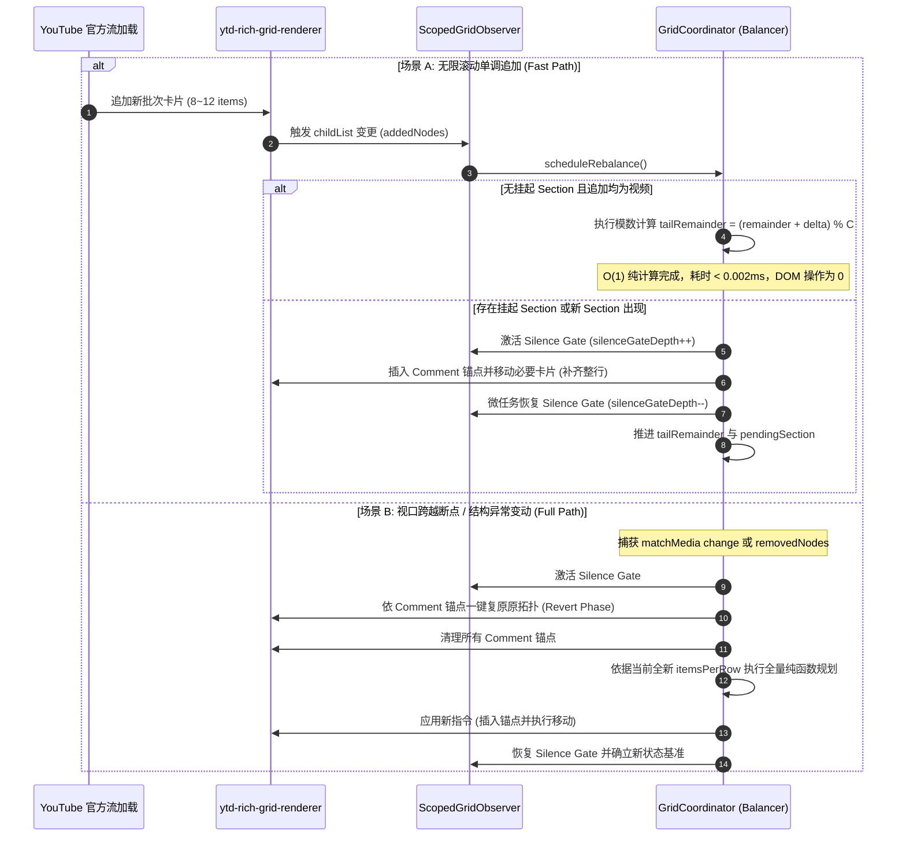
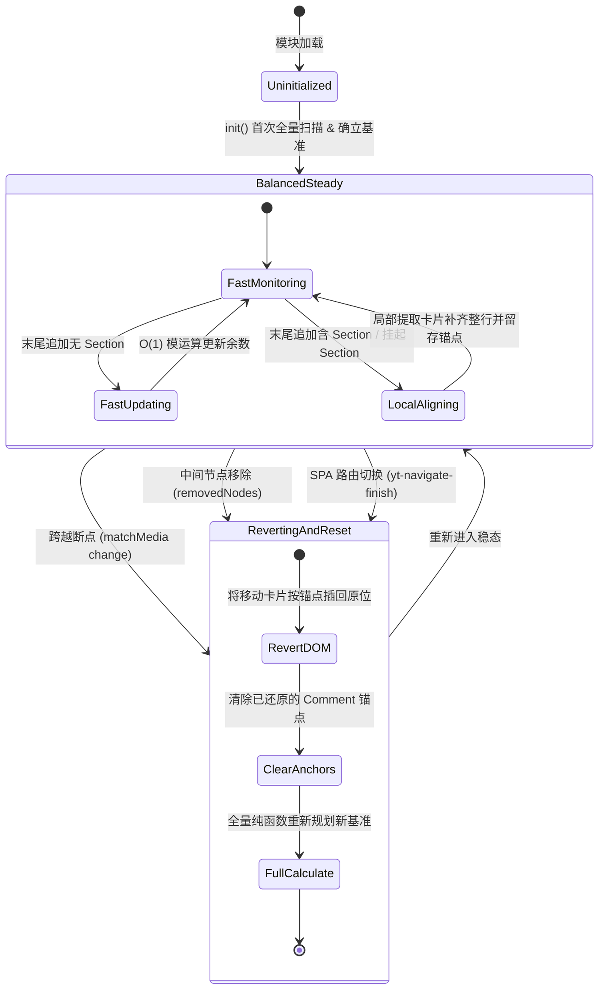

# 长列表网格自适应与增量平衡第三优先级性能深化重构方案

## 1. 方案背景与设计原则

本方案基于 **codebase-design** 深度模块理念（Deep Modules、Interface 杠杆、Seam 精准安放、Locality 内聚与 Deletion Test），针对 YouTube Turbo 在第二阶段诊断中识别出的**第三优先级性能瓶颈（架构深度深化：长列表网格布局调度与无限滚动开销）**进行全景架构深化与落地设计。

第三优先级聚焦于**长列表无限滚动流中的计算渐进退化问题与浅模块接缝重塑**，涵盖以下核心目标：
1. **双轨模数状态机（Dual-Track Modulo Automata）**：建立快速增量与全量自愈双轨调度机制。无限滚动末尾追加场景下，利用 Section 行对齐模数不变量实现 $O(1)$ 常数级纯计算判断，仅在出现跨 Section 补齐时执行局部微量 DOM 调整，杜绝每次追加均全量扫描历史 $O(N)$ 个节点的退化行为；
2. **注释锚点与拓扑可逆性（DOM Comment Anchor & Reversible Relocation）**：建立节点移动的物理可逆机制。被挪动以配平行首的卡片通过轻量 DOM 注释节点保全原始拓扑位置，在视口跨越断点或执行全量校准时实现 $O(K)$ 幂等原子复位，彻底根除跨断点反复调整引发的“节点雪球漂移”；
3. **零丢帧原子静默闸门（Zero-Drop Atomic Silence Gate）**：利用微任务引用计数闸门隔离重排期间自身的 `insertBefore` 突变自回火，取代易丢弃官方就绪记录的 `disconnect()` 机制，确保官方网络流追加记录零丢失；
4. **断点跨越原子失效与纯 CSS 承载（Breakpoint Invalidation Seam）**：严格锁定状态失效边界，仅在 `window.matchMedia` 跨越响应式断点或 SPA 路由切换时触发复位重算，其余同断点内的视口拉伸 100% 交由原生 CSS 弹性变量承载，JS 运行时开销归零；
5. **常数字符串与单向链表推进（Zero-Allocation Traversal）**：在必须进行局部 DOM 扫描时，使用标准 `nodeName` 常数全等比对与 `nextElementSibling` 指针推进，废除中间临时数组开辟与字符串大写转换，彻底消除频繁滚动时的 V8 堆内存垃圾分配。

---

## 2. 核心架构瓶颈诊断与深化方案

### 2.1 浅模块分离与全量扫描退化（`GridCoordinator` & `GridCalculator`）

#### 瓶颈诊断
当前 [`GridCoordinator.rebalance()`](../src/features/grid/coordinator.ts#L205-L230) 与 [`GridCalculator.planRebalance()`](../src/features/grid/calculator.ts#L25-L60) 的交互模式属于典型的 **Shallow Modules（浅模块）**：
```typescript
const children = Array.from(contents.children);
const types = children.map((n) => this.getNodeType(n));
const instructions = GridCalculator.planRebalance(types, itemsPerRow);
```
- **职责倒挂与高负担 Interface**：`GridCalculator` 要求调用方先准备好全量节点类型数组 `types: NodeType[]`，`GridCoordinator` 不得不承担抓取全部子元素、逐个提取标签、映射转换并在拿到指令后二次寻址 DOM 的繁重杂活；
- **计算复杂度随滚动线性退化（$O(N)$ Regression）**：
  - 用户在 YouTube 首页或订阅页无限滚动时，`contents.children` 会随加载不断累积（例如滚动 10 分钟后卡片数突破 500~1000+）；
  - 每当触底追加新的一批卡片（通常仅 8~12 个视频）时，观察器被唤醒，代码依然从第 0 个节点开始将 1000 个节点转为数组、扫描 1000 次标签名、并在 `planRebalance` 中遍历这 1000 个历史类型；
  - 实际上，**已完成行对齐的历史 Section 与视频卡片在 DOM 中的相对拓扑绝对不再变动**，其不变量被浅接口丢弃。

#### 深度重构设计：双轨模数状态机（Dual-Track Modulo Automata）
将纯计算与 DOM 状态调度深度内聚为一个 Deep Module（`GridFeedBalancer`）：
1. **数学不变量与状态降维**：
   - 每行卡片容量为 $C = \text{itemsPerRow}$；
   - `ytd-rich-section-renderer` 具有 `width: 100% !important`，占据完整行空间。因此，任何已对齐的 Section 之后，新行起始余数恒为 $0$；
   - 增量状态仅需维护：
     ```typescript
     interface TailBalanceState {
       tailRemainder: number;               // 最后一个已对齐边界之后的卡片余数 (0 <= r < C)
       pendingSection: HTMLElement | null;  // 末尾是否有后方可用视频不足、等待后续网络批次补齐的 Section
     }
     ```
2. **快速通道（Fast Path，末尾单调追加）**：
   - 若末尾无 `pendingSection` 且本批追加的 $\Delta k$ 个节点全部为普通视频卡片：
     $$\text{tailRemainder} = (\text{tailRemainder} + \Delta k) \pmod{C}$$
     DOM 移动次数为 $0$，计算复杂度为 $O(1)$，耗时 $< 0.002\text{ms}$，完全不触碰历史 DOM 节点；
   - 若末尾存在 `pendingSection`：
     从新追加卡片头部截取所需补齐数量（$C - \text{tailRemainder}$），将其前移至 `pendingSection` 之前，随后清空 `pendingSection` 并将指针推进；
   - 若新追加节点中包含新的 Section：
     仅对新追加的局部节点段执行行配平规划。
3. **全量自愈通道（Full Path，异常与断点触发）**：
   - 监听突变类型：当检测到非末尾的 `removedNodes`（如用户操作“不感兴趣”、广告卡片被移除、Shorts 货架被关闭）或页面路由切换时，触发全量纯函数自愈通道；
   - 先执行可逆复位，随后重构状态基准。

---

### 2.2 跨断点拓扑漂移与可逆复位机制（Reversible Relocation & Idempotent Reset）

#### 瓶颈诊断
在流体拉伸与列数跳变切换时：
- **流体拉伸（无列数变化）**：例如窗口宽度由 1600px 调整为 1700px，列数保持为 4。每行卡片宽度由 CSS 变量 `--ytd-rich-grid-items-per-row: 4` 与媒体查询自动按百分比缩放，DOM 节点的物理排列顺序无需调整；
- **列数物理跳变（跨越断点）**：例如宽度由 1200px 缩窄为 1000px，列数由 4 跌落至 3。
  - 若此前在 4 列下将 Section 后的卡片移动至 Section 之前，DOM 顺序已被改写；
  - 若在缺乏拓扑记忆的情况下直接以 3 列参数重新执行 `insertBefore`，Section 前方的卡片将被二次挪动，导致卡片在多次窗口拉伸缩窄后像雪球一样在 Section 前越积越多（Topological Drift）。

#### 深度重构设计：DOM 注释锚点机制（DOM Comment Anchor）
为保证 DOM 拓扑重排的**完全可逆性（Reversibility）**与**操作幂等性（Idempotency）**：
1. **移动前锚定原始拓扑**：
   - 当需要将卡片 `itemEl` 移动至 `sectionEl` 前面时，在 `itemEl` 当前所在位置插入轻量注释占位符：
     ```typescript
     const anchor = document.createComment("yt-turbo-grid-anchor");
     contents.insertBefore(anchor, itemEl);
     ```
   - 在 `itemEl` 上记录弱引用或标识属性 `data-rebalanced-anchor` 关联该锚点；
2. **全量复位阶段（Revert Phase）**：
   - 当触发断点切换（`MediaQueryListEvent`）或全量校准前，执行一键复位：
     遍历所有被标记移动的节点，将其放回对应的 `anchor` 位置并移除 `anchor`；
   - 将 DOM 拓扑以 $O(K)$ 的微小开销瞬间还原为 YouTube 原始渲染流，随后在新列数下重新计算。多次切换断点表现完全幂等，彻底根除节点单向积压。

---

### 2.3 零丢帧原子静默闸门（Zero-Drop Atomic Silence Gate）

#### 瓶颈诊断
在对 DOM 节点执行物理移动（`contents.insertBefore(itemEl, sectionEl)`）时：
- 若缺乏静默锁，将引发“脚本移动节点 $\to$ 触发 Observer $\to$ 重新计算 $\to$ 再次移动节点”的自回火突变风暴；
- 若在执行重排时直接调用 `observer.disconnect()`，会同步丢失浏览器底层已排队、由 YouTube 官方下发的待处理 `MutationRecord`，在网络流高频注入卡片时易产生追加丢帧。

#### 深度重构设计：微任务引用计数静默闸门
1. **引用计数闸门隔离（Reference Counting Gate）**：
   - 内部维护 `silenceGateDepth: number = 0`；
   - 在执行 `insertBefore` 前增加深度，在 `try...finally` 块中通过微任务队列异步递减：
     ```typescript
     public runWithSilence(action: () => void): void {
       this.silenceGateDepth++;
       try {
         action();
       } finally {
         queueMicrotask(() => {
           this.silenceGateDepth = Math.max(0, this.silenceGateDepth - 1);
         });
       }
     }
     ```
2. **无丢帧突变分流**：
   - `ScopedGridObserver` 保持物理连接不断开（不调用 `disconnect()`）；
   - 在 Observer 回调入口处校验 `if (this.silenceGateDepth > 0) return;`；
   - 自身的 `insertBefore` 触发的微任务由于同处于同步操作或先行队列，被静默闸门拦截；而官方后续派发的网络追加记录在微任务恢复后正常被捕获，实现零丢帧防回火。

---

### 2.4 堆内存零分配与单向指针推进（Zero-Allocation Traversal）

#### 瓶颈诊断
1. 每次追加触发 `rebalance()` 时执行 `Array.from(contents.children)` 会在堆内存中开辟容纳数百个 DOM 引用的连续数组；
2. 紧接着的 `.map(n => this.getNodeType(n))` 会生成第二个同样大小的字符串数组；
3. `this.getNodeType(n)` 中执行 `node.tagName.toUpperCase()` 会产生无谓的短命临时大写字符串。
频繁滚动时，这些瞬时对象在长列表场景下会高频触发 V8 引擎的 Minor GC，导致滚动微卡顿。

#### 深度重构设计
1. **原生标准标签名全等比对**：
   - 在 HTML 宿主环境中，DOM 元素的 `nodeName` 规范返回值原生即为大写字符串；
   - 直接采用 `node.nodeName === "YTD-RICH-ITEM-RENDERER"` 常量比较，杜绝字符串转换与临时对象生成；
2. **局部链表遍历与受限扫描**：
   - 废除全局 `Array.from` 转换；
   - 仅在新出现的 Section 及其后方局部窗口内，使用 `node = node.nextElementSibling` 寻找待移动的 item，扫描距离严格受限于 `itemsPerRow`（最大为 4），将循环控制在局部常数步长之内。

---

## 3. 架构时序与状态转换图

### 3.1 增量平衡与全量复位双轨时序



### 3.2 状态机状态转移图



---

## 4. 核心接口与数据结构规范

### 4.1 状态契约（`src/features/grid/types.ts`）

```typescript
export type GridNodeType = "item" | "section" | "other";

export interface TailBalanceState {
  tailRemainder: number;
  pendingSection: HTMLElement | null;
}

export interface RebalanceRelocation {
  itemElement: HTMLElement;
  anchorNode: Comment;
  targetSection: HTMLElement;
}
```

### 4.2 纯计算接缝设计（`src/features/grid/calculator.ts`）

计算层保持绝对纯函数特性，严禁持有任何 DOM 实例，提供无副作用规划算法：

```typescript
export const GridCalculator = {
  computeMetrics(windowWidth: number): { itemsPerRow: number };

  /**
   * 规划单批次或全量节点流的重排指令
   * @param elementTypes 节点类型序列
   * @param itemsPerRow 当前每行卡片数
   * @param initialRemainder 初始累积卡片余数
   * @returns 需调整的 Section 索引与对应的卡片索引，以及更新后的尾部余数
   */
  planRebalance(
    elementTypes: readonly GridNodeType[],
    itemsPerRow: number,
    initialRemainder?: number
  ): {
    instructions: Array<{ sectionIndex: number; sourceIndices: number[]; neededCount: number }>;
    finalRemainder: number;
    hasPendingSection: boolean;
  };
};
```

### 4.3 调度深模块外观（`src/features/grid/coordinator.ts`）

对外仅暴露极简高杠杆接口，隐藏内部锚点、状态机与观察器：

```typescript
export class GridCoordinator {
  public static getInstance(): GridCoordinator;
  public init(): void;
  public rebalance(): void;
  public resetToNative(): void;
  public destroy(): void;
}
```

---

## 5. 拟修改与优化文件清单

| 操作类型 | 文件相对路径 | 核心修改点与架构职责 |
| :--- | :--- | :--- |
| **[MODIFY]** | [`src/features/grid/coordinator.ts`](../src/features/grid/coordinator.ts) | 引入双轨模数状态机调度；接入 DOM 注释锚点复位机制；实现 Fast Path 与 Full Path 分流；严格对齐断点与路由生命周期 |
| **[MODIFY]** | [`src/features/grid/calculator.ts`](../src/features/grid/calculator.ts) | 提取纯函数增量模数规划算法，支持接收初始余数并返回最终余数与挂起状态 |
| **[MODIFY]** | [`src/features/grid/scoped-observer.ts`](../src/features/grid/scoped-observer.ts) | 重构静默锁为微任务引用计数闸门，移除 `disconnect()` 调用，实现零丢帧突变监听 |
| **[MODIFY]** | [`src/features/grid/constants.ts`](../src/features/grid/constants.ts) | 补充锚点标识符常量与节点名称常量 |
| **[MODIFY]** | [`src/features/grid/types.ts`](../src/features/grid/types.ts) | 声明状态机状态、节点类型与重排移动记录类型 |
| **[NEW]** | `src/features/grid/__tests__/coordinator.test.ts` | 编写断点往复切换可逆性测试、无限滚动 $O(1)$ 快速通道测试与异常删除自愈测试 |

---

## 6. 验证与回归保证

### 6.1 自动化检查
- **类型系统严格校验**：运行 `pnpm check`（`tsc --noEmit`），确保全部状态机状态、锚点映射与增量指令具有显式类型标注；
- **单元测试覆盖**：
  - 断点切换幂等性断言：模拟 4 列 $\to$ 3 列 $\to$ 4 列多次往复切换，断言 Section 前方卡片数量严格恒定，无雪球累积；
  - 增量模数计算断言：模拟连续追加仅包含视频的批次，断言 DOM `insertBefore` 调用次数精确为 0；
  - 挂起自愈断言：模拟 Section 后仅有 1 个可用视频，待后续批次追加后自动补齐整行；
  - 异常删除自愈断言：模拟中间节点被删除，断言自动触发 Full Path 重新核准全局排版。

### 6.2 运行时指标验收标准
1. **长列表滚动执行耗时**：在 YouTube 首页连续向下滚动 30 屏（加载 300+ 个卡片），通过 Chrome DevTools Performance 录制，末尾无 Section 的普通追加批次执行耗时稳定在 $< 0.005\text{ms}$；
2. **堆内存与 GC 表现**：连续滚动过程中无大块临时 DOM 数组分配，Minor GC 触发频次显著收敛；
3. **断点切换视觉无损**：在任意宽度跨越断点时，Shorts 货架与视频行边界严格对齐，无留白或变形。
