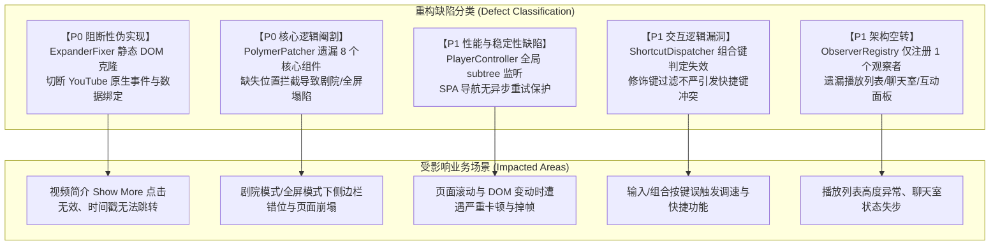

# YouTube Turbo 系统对齐与架构深度诊断报告

## 1. 报告概述与审计背景

本报告旨在从**第一性原理**出发，对原始单文件脚本 [`tampermonkey.original.user.js`](file:///e:/project/YouTube_Improvements/tampermonkey.original.user.js)（5,225 行）与当前重构后的 TypeScript 模块化源码（`src/` 目录，共 56 个模块）进行逐行级、AST 级的深度比对与架构诊断。

审计结果表明：重构版在工程化结构（Vite 6 + TypeScript 5 + 模块分层）上设计清晰，但在**内部核心业务逻辑实现**上存在多处**“视觉系伪实现”、“逻辑过度简化”与“性能缺陷”**。重构版在部分关键模块中仅完成了浅层的 DOM 搬移，切断了原版与 YouTube 底层 Polymer 引擎与数据驱动层的深度交互。

---

## 2. 核心业务模块差距与缺陷详查



---

### 2.1 Tabview 详情页核心生命周期与数据驱动层

#### 缺陷 1：简介展开器 (`ExpanderFixer`) 的破坏性 `.cloneNode` 伪实现
- **原版基准（第 988~991 行、第 2704~2738 行）**：
  原版在 `ytd-expander::defined` 自定义元素挂载钩子中，重写了 Polymer 原型方法 `calculateCanCollapse`（替换为 `funcCanCollapse`）。通过 `content.offsetHeight < content.scrollHeight` 在渲染管线中动态精准计算是否需要展示“展开/折叠”按钮，并实时监听 `childrenChanged`，**完整保留了 YouTube 原生的数据绑定与点击事件**。
- **重构版现状（`src/features/tabview/page/expander-fixer.ts` 第 41~71 行）**：
  重构版通过 `syncDescription` 将 `#description` 节点进行 **`.cloneNode(true)` 强行克隆覆盖**，并在 DOM 上硬改 `is-collapsed` / `is-expanded` 属性。
- **技术危害**：
  `.cloneNode(true)` 导致新节点丢失了所有已绑定的 Polymer Event Listeners 与数据绑定通道。直接导致：
  1. “展开 / 收起（Show more / Show less）”按钮点击彻底失效；
  2. 简介文本内的带货链接、时间戳（Timestamps）点击无法响应播放跳转；
  3. 视频动态刷新或多语言切换时，简介区域无法同步更新。

---

#### 缺陷 2：Polymer 原型劫持 (`PolymerPatcher`) 严重阉割
- **原版基准（第 2258~2400 行及各 `::defined` 钩子）**：
  原版通过 `retrieveCE` 与 `eventMap` 深度拦截了 **10 个** 核心 Custom Elements：
  1. `ytd-watch-flexy`
  2. `ytd-expander`
  3. `ytd-watch-next-secondary-results-renderer`
  4. `ytd-comments`
  5. `ytd-live-chat-frame`
  6. `ytd-engagement-panel-section-list-renderer`
  7. `ytd-structured-description-content-renderer`
  8. `ytd-video-description-infocards-section-renderer`
  9. `ytd-playlist-panel-renderer`
  10. `ytd-watch-metadata`
  
  在 `ytd-watch-flexy` 中，原版不仅代理了双栏计算，还将 `updateChatLocation`、`updatePlayerLocation`、`updateCinematicsLocation`、`updatePanelsLocation`、`swatcherooUpdatePanelsLocation` 统一包裹在 `secondaryInnerFn`（临时重定向 `#secondary-inner` ID 至 `secondary-wrapper`）上下文内执行。
- **重构版现状（`src/features/tabview/page/polymer-patcher.ts`）**：
  重构版仅象征性拦截了 `ytd-watch-flexy` 的 `isTwoColumnsChanged_` 和 `defaultTwoColumnLayoutChanged` 两个方法，其余 8 个组件及所有位置同步方法**全部遗漏**。
- **技术危害**：
  当用户切换剧院模式、全屏模式或侧边栏加载推荐视频时，官方 Polymer 控制器会直接向已被重构的 DOM 树执行默认位置计算，导致右侧分栏被清空或整个页面布局塌陷。

---

#### 缺陷 3：高亮评论 (`Linked Comment`) 缺少底层数据重排
- **原版基准（第 1575~1633 行 `lcSwapFuncA` / `lcSwapFuncB`）**：
  当用户通过包含特定评论 ID 的 URL 访问视频时，原版深入读取并修改 Polymer 控制器内的 `cnt.data.linkedCommentBadge`，在 `contents` 数组底层对调高亮评论数据项，确保在 Tabview 结构下高亮评论稳定置顶并维持响应。
- **重构版现状（`src/features/tabview/page/relocator.ts`）**：
  仅在 DOM 层做了 `replaceChildren` 物理移动。
- **技术危害**：
  跳转到指定评论时，评论区 Tab 无法正确置顶高亮该评论，甚至因 Polymer 内部索引与 DOM 状态不一致导致评论区进入无限 Loading 状态。

---

#### 缺陷 4：观察者总线 (`ObserverRegistry`) 架构空转
- **原版基准**：
  原版维护了高内聚的观察者总线：
  - `aoChat` & `aoPlayList`：同步播放列表、聊天室的折叠高度与溢出；
  - `aoEgmPanels`：处理互动面板（Engagement Panels）的展开/收起适配；
  - `moChangeReflection`：同步克隆节点的双向数据流。
- **重构版现状（`src/features/tabview/page/observer-registry.ts`）**：
  虽然封装了单例管理类，但全局仅注册了 1 个 `comments-count-watcher`。
- **技术危害**：
  在 Tab 模式下，播放列表高度无法跟随视口自适应、聊天室折叠状态失效、赞助/章节面板无法正确展开。

---

### 2.2 播放器控制、快捷调速与快捷键调度系统

#### 缺陷 1：全局 DOM 深度监听引发性能隐患
- **重构版现状（`src/features/player/controller.ts` 第 209 行）**：
  `setupObserver` 对整个 `document.documentElement` 开启了 `subtree: true` 的 MutationObserver，并在每次 DOM 变动回调中均调用 `YouTubeDOMAdapter.getVideoElement()`（高频 `querySelector`）。
- **技术危害**：
  YouTube 播放页具有海量 DOM 节点与高频动态更新特性，全局 subtree 深度监听会导致主线程出现持续的微卡顿与掉帧。应回退为原版针对特定容器或仅监听 `attributes: ['src']` 的低开销模式。

---

#### 缺陷 2：SPA 页面导航缺乏异步重试机制
- **重构版现状（`src/features/player/controller.ts`）**：
  在监听 `yt-navigate-finish` 事件时，重构版采用完全同步的方式获取 `<video>` 节点。若此时目标节点的 DOM 构建尚未完成，获取失败后未做任何异步重试。
- **技术危害**：
  在连续点击推荐视频跳转时，容易出现目标播放速率（Target Speed）与单曲循环状态恢复丢失的现象。

---

#### 缺陷 3：全局快捷键调度器组合键判定逻辑漏洞
- **重构版现状（`src/core/shortcuts.ts` 第 47 行）**：
  ```typescript
  const matchShift = binding.shiftKey === undefined || binding.shiftKey === event.shiftKey;
  ```
- **技术危害**：
  对于未显式声明 `shiftKey: false` 的快捷键（如单键 `Z`），当用户按下 `Shift + Z` 时，`binding.shiftKey === undefined` 恒为真，导致该快捷键被误触发。修饰键判定必须严格对齐布尔值：`!!binding.shiftKey === event.shiftKey`。

---

#### 缺陷 4：无损截图时间戳格式化与画布分辨率降级
- **重构版现状（`src/core/dom-adapter.ts`）**：
  1. **时间戳截断**：未换算小时（Hours），超过 60 分钟的视频截图文件名会输出为 `125-00.png` 而非 `02-05-00.png`；
  2. **画质降级隐患**：在视频元数据加载初期，回退使用了 `video.clientWidth`（CSS 渲染尺寸）作为 Canvas 尺寸，破坏了原生 1080P/4K 高保真无损输出。

---

### 2.3 4 列响应式网格布局 (`FourColumnGrid`) 的架构定位
- **审计事实**：
  经全文本与 AST 检索，原版 `tampermonkey.original.user.js` 中**完全不存在 4 列网格布局相关逻辑**。
- **定位**：
  `src/features/grid/` 为重构工程中独立自研的扩展特性，内部通过断点计算与 DOM 节点重排实现了首页/订阅页响应式排版，与原版脚本无功能冲突。

---

## 3. 缺陷严重度与对齐修复矩阵

| 缺陷编号 | 模块 | 缺陷描述 | 严重度 | 修复方案要点 |
| :--- | :--- | :--- | :---: | :--- |
| **GAP-01** | `Tabview / ExpanderFixer` | 使用 `.cloneNode` 导致原生事件与数据绑定彻底失效 | 🔴 **P0** | 废弃克隆方案，还原原版 `calculateCanCollapse` 原型拦截（`funcCanCollapse`）。 |
| **GAP-02** | `Tabview / PolymerPatcher` | 遗漏 8 个核心组件拦截与 `secondaryInnerFn` 位置保护 | 🔴 **P0** | 补全 `eventMap` 10 个 Custom Elements 拦截与剧院/全屏位置保护上下文。 |
| **GAP-03** | `Core / Shortcuts` | `ShortcutDispatcher` 修饰键判定存在逻辑漏洞导致快捷键冲突 | 🔴 **P0** | 修正修饰键比对算法，将 `undefined` 严格收敛为 `false` 匹配。 |
| **GAP-04** | `Player / Controller` | 全局 `subtree` 监听造成主线程性能浪费；SPA 跳转无重试 | 🟡 **P1** | 精简 MutationObserver 监听范围；增加视频节点异步轮询等待机制。 |
| **GAP-05** | `Tabview / ObserverRegistry` | 观察者总线未接入播放列表、聊天室与互动面板的监听 | 🟡 **P1** | 激活 `aoChat`、`aoPlayList`、`aoEgmPanels` 等细分 Observer。 |
| **GAP-06** | `Tabview / Relocator` | 缺少高亮评论（Linked Comment）Polymer 数据层重排 | 🟢 **P2** | 移植 `lcSwapFuncA/B` 对 `cnt.data.linkedCommentBadge` 的调整逻辑。 |
| **GAP-07** | `Player / Screenshot` | 截图时间戳小时换算缺失；画质回退降级隐患 | 🟢 **P2** | 补全时分秒换算；强制锁定 `video.videoWidth` 原始分辨率。 |

---

## 4. 终态架构与系统演进路径

```
┌──────────────────────────────────────────────────────────┐
│                    YouTube Turbo 目标架构                │
├──────────────────────────────────────────────────────────┤
│ 1. Core 层 (精准低开销底层)                               │
│    - ShortcutDispatcher: 严格修饰键匹配与输入焦点防冲突   │
│    - YouTubeDOMAdapter: 锁定 videoWidth 高清原始画质      │
│    - StyleEngine: 统一单例注入与样式卸载                  │
├──────────────────────────────────────────────────────────┤
│ 2. Tabview Page 运行时 (Polymer 深度介入)                 │
│    - PolymerPatcher: 完整拦截 10 个 Custom Elements       │
│    - ExpanderFixer: 基于 calculateCanCollapse 原型计算    │
│    - DOMRelocator: 包含 Linked Comment 数据对调           │
│    - ObserverRegistry: 统管 Chat/Playlist/Panels 观察者   │
├──────────────────────────────────────────────────────────┤
│ 3. Player 增强层 (生命周期与稳定性保障)                   │
│    - PlayerController: 精准属性监听 + SPA 导航异步重试     │
│    - SpeedControl: 0.1x~16x 调速与屏幕 HUD 联动          │
└──────────────────────────────────────────────────────────┘
```
