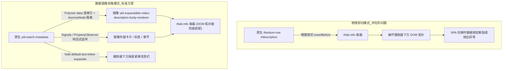
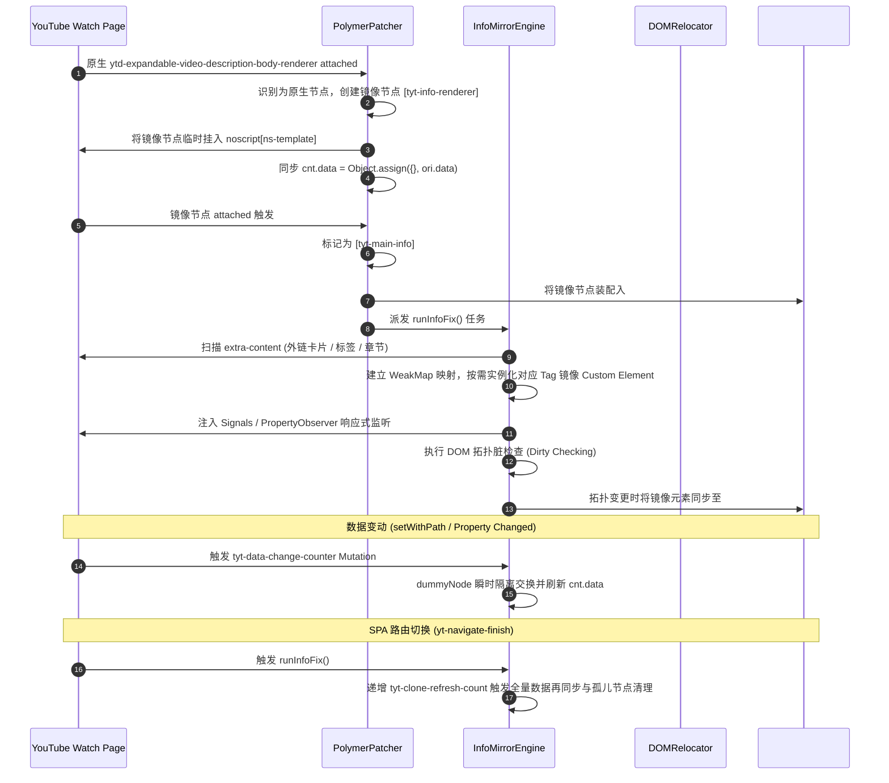

# Tabview 资讯 Tab 数据镜像与多卡片渲染重构方案

## 1. 方案概述

资讯 Tab（`#tab-info`）是 YouTube Turbo 用户脚本在视频详情页（Watch Page）中用于承载视频完整简介、社交媒体外链、制作信息、音乐/游戏卡片及章节标签的核心视图容器。

为了在侧边栏完整呈现视频简介与全部扩展卡片，同时保持播放器下方原生标题栏、频道信息、互动按钮与紧凑元数据栏的原位呈现与正常交互，本方案采用 **Polymer 虚拟数据镜像与响应式单向克隆（Data Mirroring & Polymer Clone）** 架构，替代传统的 DOM 物理剪切搬迁，实现视频元数据的高内聚、无损解耦与多卡片自适应渲染。

---

## 2. 第一性原理与核心机制分析

### 2.1 物理剪切与数据镜像模式对比



### 2.2 核心机制体系

1. **镜像节点生命周期管理与双通道拦截**：
   - 在 `PolymerPatcher` 拦截 `ytd-expandable-video-description-body-renderer` 的 `attached` 回调时区分两类执行上下文：
     - **原生节点（Native Node）**：在 `<noscript ns-template>` 中动态实例化专属镜像节点 `ytd-expandable-video-description-body-renderer[tyt-info-renderer]`，将其数据字段 `cnt.data` 与原生节点进行浅拷贝同步；
     - **镜像节点（Mirror Node）**：挂载入 `#tab-info` 容器，标记为 `[tyt-main-info]`，并在右侧栏容器就绪时执行 DOM 拓扑装配与展开器方法劫持。
2. **`InfoMirrorEngine` 响应式数据同步与 Signals 代理引擎**：
   - 扫描 `ytd-watch-metadata div[slot="extra-content"] > *` 与 `#extra-content > *` 下的全部子渲染器（如 `ytd-video-description-infocards-section-renderer`、`yt-chip-cloud-renderer` 等）；
   - 使用 `WeakMap<HTMLElement, HTMLElement>` 与 `WeakRef` 建立原生节点到镜像节点的双向弱引用映射；
   - **双通道响应式数据监听**：
     - **传统 Polymer 属性观察器**：在原型上通过 `_createPropertyObserver("data", ...)` 捕获数据变动；
     - **YouTube Polymer Signals 系统**：拦截 `signalProxy.signalCache.data.setWithPath`，在数据变化时递增原生节点的 `tyt-data-change-counter` 属性；
   - **`dummyNode` 瞬时隔离重绘**：通过 `node.replaceWith(dummyNode)` -> 数据浅拷贝 -> `dummyNode.replaceWith(node)` 触发 Polymer 内部深层模板的干净重置与重绘。
3. **DOM 拓扑脏检查（Dirty Checking）装配**：
   - 在装配子节点到 `#tab-info` 前，比对现有子节点列表与目标镜像列表；
   - 仅在节点拓扑或顺序发生实际变化时才调用 `replaceChildren` / 批量重挂载，避免滚动位置重置和文本选中丢失。
4. **展开器（`ytd-text-inline-expander`）方法劫持（`cloneMethods`）**：
   - 镜像节点内的展开器重写 `collapse` 为空操作，重写 `computeExpandButtonOffset` 为 0；
   - 劫持 `updateTextOnSnippetTypeChange`：检测到文本重排时自动将 `isExpanded` 置为 `true` 并调用 `setExpand(this, true)`，确保侧边栏内描述文本保持完全展开状态；
   - 依据 `sessionStorage` 状态与 `autoExpandInfoDesc` 实现用户偏好的自适应同步。
5. **播放器下方紧凑布局控制**：
   - 当镜像节点就绪后，在 `ytd-watch-flexy` 容器上添加 `[hide-default-text-inline-expander]` 属性；
   - 配合 CSS 规则 `ytd-watch-flexy[hide-default-text-inline-expander] #primary.style-scope.ytd-watch-flexy ytd-text-inline-expander { display: none }` 隐藏播放器下方冗余的正文展开器，同时完整保留发布日期、播放次数等精简行。

---

## 3. 架构拓扑与数据流图



---

## 4. 详细模块设计与实现方案

### 4.1 `DOMRelocator` 解耦与物理 Slot 边界规范 (`src/features/tabview/page/relocator.ts`)

- **变更点**：将 `info` 移除出 `registerDefaultSlots()` 的物理 Slot 注册列表，避免物理 DOM 剪切；
- **职责划分**：
  - 物理 Slot 仅管理：`#tab-comments`（评论区）、`#tab-videos`（推荐列表）、`#tab-list`（播放列表）；
  - `info` 由独立的 `InfoMirrorEngine` 进行生命周期与虚拟镜像管理。

### 4.2 `InfoMirrorEngine` 镜像与同步引擎 (`src/features/tabview/page/info-mirror-engine.ts`)

新建 `InfoMirrorEngine` 单例类，包含以下核心能力：

```typescript
import { PAGE_CONSTANTS } from "./constants";
import { PolymerHelper } from "./polymer-helper";
import { ExpanderFixer } from "./expander-fixer";
import type { PolymerElementInstance } from "./types";

export class InfoMirrorEngine {
  private static instance: InfoMirrorEngine | null = null;
  private mirrorNodeCache: WeakMap<HTMLElement, HTMLElement> = new WeakMap();
  private sourceNodeCache: WeakMap<HTMLElement, WeakRef<HTMLElement>> = new WeakMap();
  private dummyNode: HTMLElement = document.createElement("noscript");
  private templateContainer: HTMLElement | null = null;
  private aythlContainer: HTMLElement | null = null;

  public static getInstance(): InfoMirrorEngine {
    if (!InfoMirrorEngine.instance) {
      InfoMirrorEngine.instance = new InfoMirrorEngine();
    }
    return InfoMirrorEngine.instance;
  }

  /**
   * 获取或初始化 noscript 模板沙盒
   */
  public getOrCreateTemplateSandbox(): HTMLElement {
    if (!this.templateContainer || !this.templateContainer.isConnected) {
      let ns = document.querySelector<HTMLElement>("ytd-watch-flexy noscript[ns-template]");
      if (!ns) {
        ns = document.createElement("noscript");
        ns.setAttribute("ns-template", "");
        document.querySelector("ytd-watch-flexy")?.appendChild(ns);
      }
      this.templateContainer = ns;
    }
    return this.templateContainer;
  }

  /**
   * 获取或初始化 aythl 镜像暂存沙盒
   */
  public getOrCreateAythlSandbox(flexy: HTMLElement): HTMLElement {
    if (!this.aythlContainer || !this.aythlContainer.isConnected) {
      let ns = document.querySelector<HTMLElement>("noscript#aythl");
      if (!ns) {
        ns = document.createElement("noscript");
        ns.id = "aythl";
        flexy.insertBefore(ns, flexy.firstChild);
      }
      this.aythlContainer = ns;
    }
    return this.aythlContainer;
  }

  /**
   * 执行 extra-content 与主描述的镜像与同步
   */
  public runInfoFix(): void {
    const tabInfo = document.querySelector<HTMLElement>(PAGE_CONSTANTS.SELECTORS.TAB_INFO_CONTAINER);
    const flexy = document.querySelector<HTMLElement>(PAGE_CONSTANTS.SELECTORS.YTD_WATCH_FLEXY);
    const mainInfoRenderer = document.querySelector<HTMLElement>(PAGE_CONSTANTS.SELECTORS.TYT_INFO_RENDERER);

    if (!tabInfo || !flexy) {
      return;
    }

    const sourceElements = this.queryExtraContentSources();
    const mirrorElements: HTMLElement[] = [];
    const sandbox = this.getOrCreateAythlSandbox(flexy);
    let isTopologyChanged = false;

    for (let i = 0; i < sourceElements.length; i++) {
      const srcEl = sourceElements[i];
      const srcCnt = PolymerHelper.insp(srcEl);
      const tagName = srcCnt?.is || srcEl.tagName.toLowerCase();
      let mirrorEl = this.mirrorNodeCache.get(srcEl);

      if (!mirrorEl || !mirrorEl.isConnected) {
        mirrorEl = document.createElement(tagName);
        sandbox.appendChild(mirrorEl);
        this.bindDataReflection(srcEl, mirrorEl);
        this.mirrorNodeCache.set(srcEl, mirrorEl);
        this.sourceNodeCache.set(mirrorEl, new WeakRef(srcEl));
        isTopologyChanged = true;
      }

      const mirrorCnt = PolymerHelper.insp(mirrorEl);
      if (mirrorCnt && srcCnt?.data && mirrorCnt.data !== srcCnt.data) {
        // 利用虚拟占位节点保证深层 Polymer 干净重置
        mirrorEl.replaceWith(this.dummyNode);
        mirrorCnt.data = Object.assign({}, srcCnt.data);
        this.dummyNode.replaceWith(mirrorEl);
      }

      mirrorElements.push(mirrorEl);
    }

    // 检查 DOM 现有子节点排布是否需要实际变动 (Dirty Checking)
    if (!isTopologyChanged) {
      const currentChildren = Array.from(tabInfo.children);
      const expectedChildren = [mainInfoRenderer, ...mirrorElements].filter(Boolean) as HTMLElement[];
      if (
        currentChildren.length !== expectedChildren.length ||
        currentChildren.some((el, idx) => el !== expectedChildren[idx])
      ) {
        isTopologyChanged = true;
      }
    }

    if (isTopologyChanged) {
      this.assignTabInfoChildren(tabInfo, mainInfoRenderer, mirrorElements);
      this.notifyRefreshCount(mirrorElements);
    }
  }

  /**
   * 查询所有待镜像的 extra-content 子源节点
   */
  private queryExtraContentSources(): HTMLElement[] {
    const rawElements = Array.from(
      document.querySelectorAll<HTMLElement>(
        'ytd-watch-metadata.ytd-watch-flexy div[slot="extra-content"] > *, ytd-watch-metadata.ytd-watch-flexy #extra-content > *'
      )
    );

    const result: HTMLElement[] = [];
    for (let i = 0; i < rawElements.length; i++) {
      let el: HTMLElement | null = rawElements[i];
      const cnt = PolymerHelper.insp(el);
      if (cnt && typeof cnt.is === "string") {
        const targetTag = cnt.is;
        while (el && el instanceof HTMLElement) {
          const matched = Array.from(el.querySelectorAll<HTMLElement>(targetTag)).filter(
            (candidate) => Boolean(PolymerHelper.insp(candidate)?.data)
          );
          if (matched.length > 0) {
            result.push(matched[0]);
            break;
          }
          el = el.parentElement;
        }
      }
    }
    return result;
  }

  /**
   * 采用无闪烁 DocumentFragment 方式装配子节点
   */
  private assignTabInfoChildren(
    container: HTMLElement,
    mainNode: HTMLElement | null,
    nextSiblings: HTMLElement[]
  ): void {
    const fragment = document.createDocumentFragment();
    if (mainNode) {
      fragment.appendChild(mainNode);
    }
    for (let i = 0; i < nextSiblings.length; i++) {
      fragment.appendChild(nextSiblings[i]);
    }
    container.replaceChildren(fragment);
  }

  /**
   * 建立原生与镜像节点间的数据变动监听通道
   */
  private bindDataReflection(sourceEl: HTMLElement, mirrorEl: HTMLElement): void {
    sourceEl.setAttribute(PAGE_CONSTANTS.ATTRIBUTES.TYT_DATA_OBSERVED, "1");

    const srcCnt = PolymerHelper.insp(sourceEl);
    const cProto = srcCnt ? Object.getPrototypeOf(srcCnt) : null;

    // 1. 传统 Polymer 属性观察器拦截
    if (cProto && !(cProto instanceof Node) && !cProto._dataChangedObserver && typeof cProto._createPropertyObserver === "function") {
      cProto._dataChangedObserver = function (this: PolymerElementInstance): void {
        const node = this.hostElement || (this as unknown as HTMLElement);
        if (node instanceof HTMLElement && node.hasAttribute(PAGE_CONSTANTS.ATTRIBUTES.TYT_DATA_OBSERVED)) {
          const current = Number(node.getAttribute(PAGE_CONSTANTS.ATTRIBUTES.TYT_DATA_CHANGE_COUNTER) || "0") + 1;
          node.setAttribute(PAGE_CONSTANTS.ATTRIBUTES.TYT_DATA_CHANGE_COUNTER, String(current > 1e9 ? 1 : current));
        }
      };
      cProto._createPropertyObserver("data", "_dataChangedObserver", undefined);
    }

    // 2. YouTube Polymer Signals 拦截
    if (srcCnt?.signalProxy?.signalCache?.data) {
      const dataSignal = srcCnt.signalProxy.signalCache.data;
      if (typeof dataSignal.setWithPath === "function" && !dataSignal.__patched) {
        dataSignal.__patched = true;
        const rawSetWithPath = dataSignal.setWithPath;
        dataSignal.setWithPath = function (this: unknown, ...args: unknown[]): unknown {
          const result = rawSetWithPath.apply(this, args);
          if (sourceEl.isConnected) {
            const current = Number(sourceEl.getAttribute(PAGE_CONSTANTS.ATTRIBUTES.TYT_DATA_CHANGE_COUNTER) || "0") + 1;
            sourceEl.setAttribute(PAGE_CONSTANTS.ATTRIBUTES.TYT_DATA_CHANGE_COUNTER, String(current > 1e9 ? 1 : current));
          }
          return result;
        };
      }
    }

    // 3. MutationObserver 触发镜像数据刷新
    const observer = new MutationObserver((mutations) => {
      let shouldRefresh = false;
      for (let i = 0; i < mutations.length; i++) {
        const m = mutations[i];
        if (
          m.attributeName === PAGE_CONSTANTS.ATTRIBUTES.TYT_CLONE_REFRESH_COUNT ||
          m.attributeName === PAGE_CONSTANTS.ATTRIBUTES.TYT_DATA_CHANGE_COUNTER
        ) {
          shouldRefresh = true;
          break;
        }
      }

      if (shouldRefresh) {
        const currentSrcCnt = PolymerHelper.insp(sourceEl);
        const currentMirCnt = PolymerHelper.insp(mirrorEl);
        if (currentSrcCnt?.data && currentMirCnt) {
          mirrorEl.replaceWith(this.dummyNode);
          currentMirCnt.data = Object.assign({}, currentSrcCnt.data);
          this.dummyNode.replaceWith(mirrorEl);
        }
      }
    });

    observer.observe(sourceEl, {
      attributes: true,
      attributeFilter: [
        PAGE_CONSTANTS.ATTRIBUTES.TYT_CLONE_REFRESH_COUNT,
        PAGE_CONSTANTS.ATTRIBUTES.TYT_DATA_CHANGE_COUNTER
      ]
    });
  }

  /**
   * 递增刷新计数器触发全局双向同步
   */
  private notifyRefreshCount(mirrorElements: HTMLElement[]): void {
    for (let i = 0; i < mirrorElements.length; i++) {
      const mirrorEl = mirrorElements[i];
      const current = Number(mirrorEl.getAttribute(PAGE_CONSTANTS.ATTRIBUTES.TYT_CLONE_REFRESH_COUNT) || "0") + 1;
      const countVal = String(current > 1e9 ? 1 : current);
      mirrorEl.setAttribute(PAGE_CONSTANTS.ATTRIBUTES.TYT_CLONE_REFRESH_COUNT, countVal);

      const srcWeakRef = this.sourceNodeCache.get(mirrorEl);
      const srcEl = srcWeakRef?.deref();
      if (srcEl && srcEl.isConnected) {
        srcEl.setAttribute(PAGE_CONSTANTS.ATTRIBUTES.TYT_CLONE_REFRESH_COUNT, countVal);
      }
    }
  }
}
```

### 4.3 `PolymerPatcher` 描述渲染器拦截重构 (`src/features/tabview/page/polymer-patcher.ts`)

重构 `patchExpandableDescription`，实现双通道分流：

```typescript
private async patchExpandableDescription(): Promise<void> {
  const proto = await PolymerHelper.retrieveCE(PAGE_CONSTANTS.TAGS.EXPANDABLE_DESC_BODY_RENDERER);
  if (!proto) {
    return;
  }

  this.hookMethod(proto, "attached", (rawMethod) => {
    return function (this: PolymerElementInstance, ...args: unknown[]): unknown {
      const hostElement = this.hostElement || (this as unknown as HTMLElement);
      if (hostElement instanceof HTMLElement && hostElement.isConnected) {
        if (hostElement.hasAttribute(PAGE_CONSTANTS.ATTRIBUTES.TYT_INFO_RENDERER)) {
          // 通道 1：镜像节点挂载完成
          hostElement.setAttribute(PAGE_CONSTANTS.ATTRIBUTES.TYT_MAIN_INFO, "");
          const inlineExpander = hostElement.querySelector<HTMLElement>(PAGE_CONSTANTS.SELECTORS.TEXT_INLINE_EXPANDER);
          if (inlineExpander) {
            const inlineCnt = PolymerHelper.insp(inlineExpander);
            if (inlineCnt) {
              ExpanderFixer.fixInlineExpanderMethods(inlineCnt);
            }
          }
          InfoMirrorEngine.getInstance().runInfoFix();
        } else if (!hostElement.closest(PAGE_CONSTANTS.SELECTORS.TAB_INFO_CONTAINER) && !hostElement.closest("noscript")) {
          // 通道 2：原生节点挂载完成，创建/同步镜像节点
          const sandbox = InfoMirrorEngine.getInstance().getOrCreateTemplateSandbox();
          let mirrorNode = document.querySelector<HTMLElement>(
            `${PAGE_CONSTANTS.TAGS.EXPANDABLE_DESC_BODY_RENDERER}[${PAGE_CONSTANTS.ATTRIBUTES.TYT_INFO_RENDERER}]`
          );
          if (!mirrorNode) {
            mirrorNode = document.createElement(PAGE_CONSTANTS.TAGS.EXPANDABLE_DESC_BODY_RENDERER);
            mirrorNode.setAttribute(PAGE_CONSTANTS.ATTRIBUTES.TYT_INFO_RENDERER, "");
            sandbox.appendChild(mirrorNode);
          }
          const mirrorCnt = PolymerHelper.insp(mirrorNode);
          const rawCnt = PolymerHelper.insp(hostElement);
          if (mirrorCnt && rawCnt?.data) {
            mirrorCnt.data = Object.assign({}, rawCnt.data);
          }
          const inlineExpander = mirrorNode.querySelector<HTMLElement>(PAGE_CONSTANTS.SELECTORS.TEXT_INLINE_EXPANDER);
          if (inlineExpander) {
            const inlineCnt = PolymerHelper.insp(inlineExpander);
            if (inlineCnt) {
              ExpanderFixer.fixInlineExpanderMethods(inlineCnt);
            }
          }
        }
      }
      return rawMethod.apply(this, args);
    };
  });
}
```

### 4.4 展开器行为劫持扩展 (`src/features/tabview/page/expander-fixer.ts`)

完善 `fixInlineExpanderMethods`，注入 `cloneMethods` 契约：

```typescript
export function fixInlineExpanderMethods(cnt: PolymerElementInstance): void {
  if (!cnt || cnt.__isInlineExpanderFixed) {
    return;
  }
  cnt.__isInlineExpanderFixed = true;

  // 1. 禁用折叠
  cnt.collapse = (): void => {};
  cnt.computeExpandButtonOffset = (): number => 0;
  cnt.dataChanged = (): void => {};

  // 2. 劫持更新并强制常开展开
  cnt.updateTextOnSnippetTypeChange = function (this: PolymerElementInstance): void {
    if (this.isResetMutation === false) {
      this.isResetMutation = true;
    }
    if (this.isExpanded === true) {
      this.isExpanded = false;
    }
    if (typeof this.set === "function") {
      this.set("isExpanded", true);
      this.isExpandedChanged?.();
    } else {
      this.isExpanded = true;
      this.isExpandedChanged?.();
    }
    if (this.isResetMutation === false) {
      this.isResetMutation = true;
    }
  };

  if (typeof cnt.isResetMutation === "boolean") {
    cnt.isResetMutation = true;
  }
  if (typeof cnt.collapseLabel === "string") {
    cnt.collapseLabel = "";
  }

  fixInlineExpanderDisplay(cnt);
}
```

### 4.5 导航调度与生命周期联动 (`src/features/tabview/page/coordinator.ts`)

在 `NavigationCoordinator` 中挂载 SPA 路由监听与镜像数据刷新：

- 在 `handleRouteChange`（`yt-navigate-finish`）中，调用 `InfoMirrorEngine.getInstance().runInfoFix()`；
- 当 `TYT_INFO_RENDERER` 就绪时，为 `ytd-watch-flexy` 赋予 `[hide-default-text-inline-expander]` 属性；
- 在 Tab 切换至 `info` 时，调用 `ExpanderFixer.getInstance()?.fixForTabDisplay(false, "#tab-info")` 触发各卡片 `notifyResize()` 与 `resize(false)`。

---

## 5. 验证与质量保证计划

### 5.1 自动化编译与类型检查
- 执行严格类型检查：`pnpm run check`，必须通过且无 any 逃逸；
- 执行构建产物打包：`pnpm run build`，确认 `dist/youtube-turbo.user.js` 生成正常。

### 5.2 业务功能验证矩阵
1. **播放器下方布局原位验证**：
   - 播放器下方视频标题、发布者头像、订阅按钮、点赞/分享/下载按钮处于原位且排版正常；
   - 简介区域处于紧凑收起行展示（发布日期 + 观看次数），无冗余的大块空白或缺失。
2. **资讯 Tab 内容完整度验证**：
   - 视频详细描述富文本完整呈现，且默认处于完全展开状态；
   - 包含的社交媒体外链（SNS）、话题标签（Hashtags）、制作人员信息正常渲染；
   - 音乐/游戏扩展卡片（`slot="extra-content"`）与频道标签云按原顺序完整镜像展示。
3. **SPA 单页路由切换验证**：
   - 在连续点击右侧推荐视频时，资讯 Tab 随路由切换无缝刷新为新视频的对应简介与扩展卡片；
   - 浏览器前进/后退（`popstate`）时，镜像状态与数据保持精确同步。
