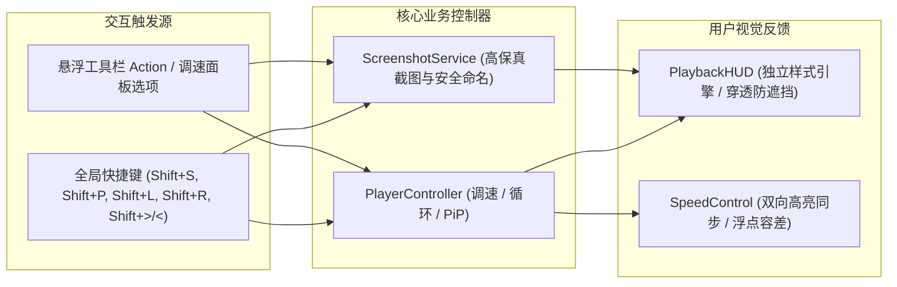
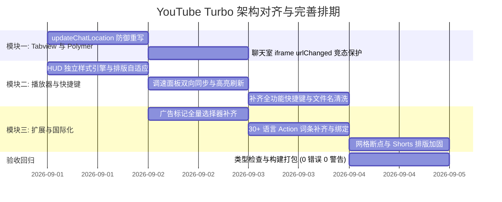

# YouTube Turbo 核心特性全量对齐与架构完善方案

## 1. 方案概述

为了确保 YouTube Turbo 用户脚本在 YouTube 桌面端具备极致的稳定性、完全对齐的原生交互体验以及高内聚可维护的工程化架构，本方案针对前期深度审计中发现的系统性缺失，对以下三大核心模块制定全量对齐与加固实施规范：

1. **Tabview 核心架构与 Polymer 原型拦截加固**：重构聊天室位置保护机制、补充 iframe 异步加载防竞态与观察者生命周期清理、规范评论区滚动容器状态闭环；
2. **播放器控制、快捷键体系与通用 HUD 提示系统**：解耦全局通用 HUD 独立样式引擎（支持全屏层级与点击穿透）、实现调速面板与快捷键双向同步、补齐全功能全局快捷键与跨键盘标准化、规范截图路径安全清洗；
3. **扩展特性、广告视觉标记、工具箱与国际化多语言体系**：补齐广告与 Premium 弹窗视觉标记、健全工具栏 30+ 语言多语言词条体系、完善响应式网格断点与 Shorts 货架排版常量收敛。

---

## 2. 模块一：Tabview 核心架构与 Polymer 原型拦截加固

### 2.1 聊天室位置防塌陷拦截重构 (`src/features/tabview/page/polymer-patcher.ts`)
- **设计原理**：YouTube 原生 `ytd-watch-flexy.prototype.updateChatLocation` 会在视口尺寸变化或全屏/剧院模式切换时将 `#chat` 抽离当前包装器并移回主区域。必须从通用的 `locationMethods` 拦截列表中剔除 `"updateChatLocation"`，单独对其进行原型拦截，仅触发页面媒体查询与播放器尺寸更新，阻止 DOM 移位。
- **实现契约**：
  ```typescript
  // 1. 在 locationMethods 列表中移除 updateChatLocation，避免被通用 runInProtectedContext 包装覆盖原生行为
  const locationMethods: ReadonlyArray<string> = [
    "isTwoColumnsChanged_",
    "defaultTwoColumnLayoutChanged",
    "updatePlayerLocation",
    "updateCinematicsLocation",
    "updatePanelsLocation",
    "swatcherooUpdatePanelsLocation",
    "updateErrorScreenLocation",
    "updateFullBleedElementLocations"
  ];

  // 2. 单独对 updateChatLocation 进行拦截
  this.hookMethod(proto, "updateChatLocation", () => {
    return function (this: PolymerElementInstance): void {
      if (this.is !== "ytd-watch-grid") {
        PolymerPatcher.getInstance().runInProtectedContext(() => {
          this.updatePageMediaQueries?.();
          this.schedulePlayerSizeUpdate_?.();
        });
      }
    };
  });
  ```

### 2.2 聊天室 iframe 渲染竞态与观察者内存防护 (`src/features/tabview/page/polymer-patcher.ts`)
- **设计原理**：切入直播或折叠聊天室时，iframe 在零尺寸或未就绪状态下触发原生 `urlChanged` 易造成白屏或异常。通过 `IntersectionObserver` 监测 iframe 具备实际几何尺寸后再触发原生加载。同时采用 `WeakMap` 隔离每个元素实例的加载令牌，避免跨实例并发竞争；在 `Promise.race` 结束时通过 `finally` 显式释放观察者，杜绝内存泄漏；超时与位掩码常量统一收敛至 `PAGE_CONSTANTS`。
- **实现契约**：
  ```typescript
  // 使用 WeakMap 隔离元素实例级别的异步令牌
  const chatFrameTokens = new WeakMap<PolymerElementInstance, number>();

  // 在 patchLiveChatFrame 中重写 urlChanged
  this.hookMethod(proto, "urlChanged", (rawMethod) => {
    return async function (this: PolymerElementInstance): Promise<void> {
      const nextToken = ((chatFrameTokens.get(this) ?? 0) & PAGE_CONSTANTS.MASKS.TOKEN_MASK) + 1;
      chatFrameTokens.set(this, nextToken);

      const chatframe = (this.chatframe || (this.$ && this.$.chatframe)) as HTMLIFrameElement | undefined;
      
      if (chatframe instanceof HTMLIFrameElement) {
        if (!chatframe.contentDocument) {
          await Promise.resolve();
          if (chatFrameTokens.get(this) !== nextToken) return;
        }
        
        const isBlank = !this.data || Boolean(this.collapsed);
        let observer: IntersectionObserver | null = null;

        try {
          const timeoutPromise = new Promise<boolean>((resolve) => 
            setTimeout(() => resolve(false), PAGE_CONSTANTS.TIMEOUTS.CHAT_FRAME_READY_MS)
          );
          const intersectionPromise = new Promise<boolean>((resolve) => {
            observer = new IntersectionObserver((entries) => {
              for (let i = 0; i < entries.length; i++) {
                const rect = entries[i].boundingClientRect;
                if (isBlank || (rect.width > 0 && rect.height > 0)) {
                  resolve(true);
                  break;
                }
              }
            });
            observer.observe(chatframe);
          });

          await Promise.race([timeoutPromise, intersectionPromise]);
        } finally {
          observer?.disconnect();
        }

        if (chatFrameTokens.get(this) !== nextToken) return;
      }
      return rawMethod.apply(this);
    };
  });
  ```

### 2.3 评论区滚动容器生命周期闭环 (`src/features/tabview/page/coordinator.ts` 与 `observer-registry.ts`)
- **设计规范**：
  - 在 `NavigationCoordinator.handleRouteChange` 路由完成与右侧栏挂载后，主动清除 `ytd-watch-flexy` 的 `keep-comments-scroller` 属性，重置评论区滚动表现；
  - 在 `ObserverRegistry.observeComments`（`ioComment` 视口交错观察者）中，当评论区进入视口且触发展开计算时，动态赋予 `keep-comments-scroller` 属性，形成完整的生命周期闭环。

---

## 3. 模块二：播放器控制、快捷键与通用 HUD 提示系统



### 3.1 全局 HUD 样式引擎独立解耦与穿透防护 (`src/core/hud.ts`)
- **设计原理**：将 HUD 提示样式从播放器业务代码剥离，收敛至 `PlaybackHUD` 单例，采用 `StyleEngine` 自动按需注入；
- **排版与防护规范**：
  - 弹性排版：`min-width: 80px; width: auto; min-height: 80px; padding: 0 20px; display: inline-flex; justify-content: center; align-items: center; white-space: nowrap;`，自适应兼容速率文本（`2.0×`）与状态文案（`截图已保存` / `单曲循环: 开启`）；
  - 穿透与层级：显式设置 `pointer-events: none !important; user-select: none !important; z-index: 2147483640 !important;`，防止 HUD 在显示或淡出过程中遮挡视频点击播放/暂停及控制栏交互。

### 3.2 调速面板双向激活态同步与浮点容差 (`src/features/player/speed-control.ts`)
- **设计规范**：在 `PlayerController.onStateChange` 回调中，遍历并刷新浮层选项 `.SpeedControl_Extension_Speed-Option-Item`：
  - 采用 `Math.abs(parseFloat(optionSpeed) - currentSpeed) < PLAYBACK_RATE_EPSILON` 进行浮点数容差比对；
  - 若当前速率与选项预设一致，赋予 `.SpeedControl_Extension_Speed-Option-Item-Active`；
  - 若为快捷键调节出的非预设速率（如 `1.75×`），移除所有预设高亮，右下角控制按钮正常显示实时速率文本。

### 3.3 全功能快捷键调度体系与按键标准化 (`src/core/shortcuts.ts`)
- **快捷键映射表**：
  | 组合键 | 动作行为 | HUD 提示反馈 |
  | :--- | :--- | :--- |
  | `Shift + >` / `Shift + .` | 递增播放速率（+0.25x，上限 16.0x） | `${speed}×` |
  | `Shift + <` / `Shift + ,` | 递减播放速率（-0.25x，下限 0.25x） | `${speed}×` |
  | `Shift + R` | 重置播放速率为 `1.0×` | `1.0×` |
  | `Shift + S` | 当前视频帧高保真无损截图并下载 | 提示 `截图已保存` |
  | `Shift + P` | 切换原生画中画（Picture-in-Picture） | 提示 `画中画: 开启/关闭` |
  | `Shift + L` | 切换单曲循环播放（Loop Playback） | 提示 `单曲循环: 开启/关闭` |

- **按键字符标准化与输入防冲突**：
  - 标准化匹配：在 `ShortcutDispatcher` 中对 `Shift` 组合符号键进行别名归一化（如同时兼容 `event.key === ">"` 以及 `event.key === "." && event.shiftKey`），确保在不同操作系统、键盘布局及浏览器下准确触发；
  - Shadow DOM 穿透判定：在 `isTypingContext` 中通过 `event.composedPath()` 深度判定 `input`、`textarea`、`contenteditable`、`tp-yt-paper-*`、`ytd-searchbox`、`ytd-commentbox`、`yt-live-chat-*` 等输入焦点，防止快捷键误触。

### 3.4 截图文件名安全清洗与空值兜底 (`src/features/player/screenshot.ts`)
- **文件名生成规范**：
  ```typescript
  export function sanitizeFileName(name: string, fallback = "YouTube_Video"): string {
    const cleaned = name.replace(/[/\\:*?"<>|]/g, "_").trim();
    return cleaned.length > 0 ? cleaned : fallback;
  }
  ```
  - 过滤操作系统非法路径字符；
  - 对空标题或全特殊字符标题进行默认回退，确保下载文件名合规。

---

## 4. 模块三：扩展特性、广告标记、工具箱与国际化多语言体系

### 4.1 广告与推广位视觉标记扩展 (`src/features/adblock/index.ts`)
- **全量选择器矩阵**：
  ```css
  #masthead-ad,
  .video-ads.ytp-ad-module,
  ytd-ad-slot-renderer,
  ad-slot-renderer,
  yt-mealbar-promo-renderer,
  ytm-companion-ad-renderer,
  #related #player-ads,
  #related ytd-ad-slot-renderer,
  ytd-engagement-panel-section-list-renderer[target-id="engagement-panel-ads"],
  ytd-rich-item-renderer.style-scope.ytd-rich-grid-row #content:has(.ytd-display-ad-renderer),
  tp-yt-paper-dialog:has(yt-mealbar-promo-renderer),
  ytd-popup-container:has(a[href="/premium"])
  ```
- **视觉与生命周期规则**：
  - 统一注入 `${selector} * { text-decoration: line-through !important; text-decoration-thickness: 2px !important; }`，并对容器保持半透明标注；
  - 统一通过 `StyleEngine.inject("mark-or-remove-ad", cssText)` 与 `StyleEngine.remove` 纳管。

### 4.2 工具栏 30+ 语言多语言词条体系 (`src/i18n/locales.ts`)
- **补齐字典词条契约**：
  在全部 30+ 种语言字典中完整补充以下 6 个核心 Action 悬浮提示与 HUD 状态词条：
  ```typescript
  export interface LocaleContent {
    // 基础功能设置词条...
    action_setting: string;
    action_switch_theme: string;
    action_screenshot: string;
    action_pip: string;
    action_loop: string;
    action_download: string;
    hud_screenshot_saved: string;
    hud_pip_enabled: string;
    hud_pip_disabled: string;
    hud_loop_enabled: string;
    hud_loop_disabled: string;
  }
  ```
- **工具栏 Action 绑定改造**：在 `Toolbar` 默认动作注册中使用 `action_*` 作为 `titleKey`，确保悬浮 Tooltip 随页面语言实时自适应，杜绝英文 fallback 断层。

### 4.3 响应式网格断点与 Shorts 货架排版完善 (`src/features/grid/index.ts`)
- **断点与列数常量收敛**：
  - 消除硬编码，在 `GRID_CONSTANTS` 中统一收敛桌面断点、视频列数（`COLUMNS.FOUR` / `THREE` / `TWO` / `ONE`）以及 Shorts 货架列数（`SLIM_COLUMNS.SIX` / `FIVE` / `THREE` / `TWO`）；
  - 针对首页与订阅页中的 Shorts 货架（`ytd-rich-shelf-renderer`）注入弹性卡片宽度，自适应计算 `--ytd-rich-grid-slim-items-per-row`，杜绝宽屏下布局拉伸变形。

---

## 5. 实施与分步验证计划



### 5.1 质量门禁与验证指标
1. **静态类型安全**：`pnpm run check` $\rightarrow$ 严格模式 **0 错误、0 警告**；
2. **构建完整性**：`pnpm run build` $\rightarrow$ 正确输出单文件 `dist/youtube-turbo.user.js`；
3. **全链路交互回归**：
   - 剧院模式与尺寸缩放时聊天室位置稳定；
   - 快捷键调速、截图、画中画、循环播放流畅触发且伴随精准 HUD 提示；
   - 工具栏悬浮文字与系统多语言精准对齐；
   - 页面广告与 Premium 弹窗被准确标记。
