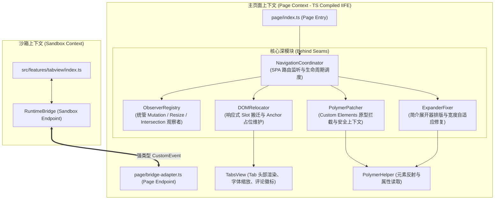
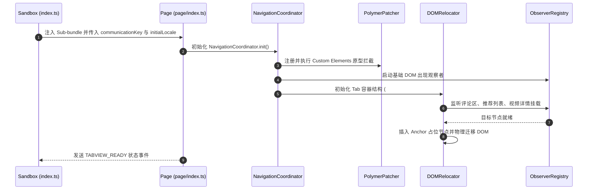
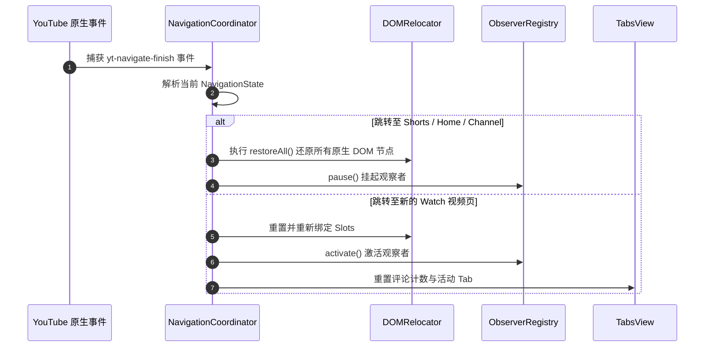
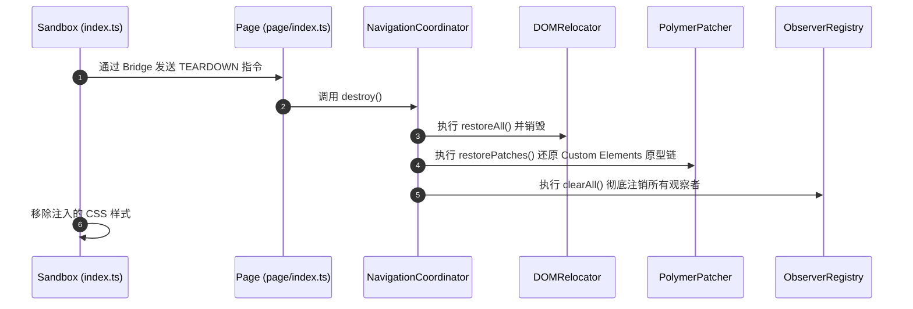
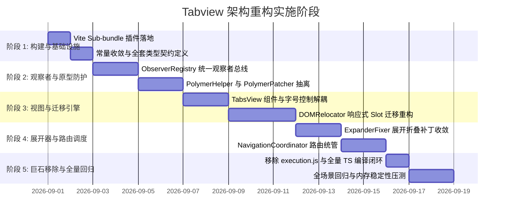

# Tabview 模块深度架构重构方案

## 1. 概述与重构背景

在 YouTube Improvements 扩展系统的整体工程化进程中，核心通用基础设施（`src/core/`）与外围业务特性（`src/features/player/`、`src/features/grid/`、`src/features/theme/`、`src/features/adblock/`、`src/ui/toolbar/`）均已完成基于 **Vite 6 + TypeScript 5** 的深模块化改造。

目前全仓核心遗留技术债集中在 [src/features/tabview/execution.js](file:///e:/project/YouTube_Improvements/src/features/tabview/execution.js)。该文件长达 **3,444 行 (153 KB)**，作为一个庞大的未类型化 JavaScript 闭包，通过文本形式注入主页面运行。

本方案旨在将该巨石执行脚本彻底解耦，重构为由 **清晰 Seam 隔离、强类型约束、完备 Teardown 与 DOM 还原机制、独立 Sub-bundle 编译管道** 支撑的现代 TypeScript 多模块系统。

---

## 2. 第一性原理与核心架构目标

### 2.1 核心痛点与第一性原理剖析
1. **作用域污染与认知负载**：单闭包内包含 120 余个顶级变量与函数，DOM 操作、Custom Elements 原型劫持、Tab 渲染、字号缩放等逻辑高度交织，缺乏状态隔离。
2. **生命周期失控与 SPA 内存泄漏**：存在 10 余个独立的 `MutationObserver`、`ResizeObserver` 与 `IntersectionObserver` 实例。在 YouTube SPA 路由高频跳转（视频页 $\leftrightarrow$ Shorts $\leftrightarrow$ 首页 $\leftrightarrow$ 频道页）时，缺乏集中注销机制，易产生僵尸观察者（Zombie Observers）。
3. **YouTube 原生 Custom Elements 原型链冲突**：YouTube 内部方法（如 `ytd-watch-flexy.prototype.updateChatLocation`、`updatePanelsLocation`）在窗口缩放或原生状态改变时会重置 DOM 树。若无结构化的原型拦截与上下文保护，Tabview 的 DOM 容器会被原生逻辑破坏。
4. **编译构建断层与类型安全缺失**：执行脚本脱离 TypeScript 编译体系与 Vite 构建优化，缺乏编译期类型校验与单元测试支持。

### 2.2 核心重构目标
- **完备的 TypeScript 严格模式覆盖**：页面端与沙箱端代码均采用强类型契约，禁止隐式 `any`。
- **高内聚深模块（Deep Modules）**：通过窄接口封装内部复杂性，清晰划定职责边界。
- **全生命周期受控（Full Lifecycle Control）**：支持即时挂载（Mount）、路由状态迁移（Route Transition）、DOM 原位复原（DOM Restore）与彻底卸载（Teardown）。
- **自动化 Sub-bundle 构建管道**：在 Vite 构建流程中无缝实现页面端 TS 模块的独立内存编译与打包注入。

---

## 3. 目标架构拓扑 (Target Architecture)

重构后系统由 **沙箱端（Sandbox Context）** 与 **主页面端（Page Context）** 构成，跨上下文通过强类型 `RuntimeBridge` 通信，页面上下文内部依据职责划分为 **5 大核心引擎深模块**、**1 个表现层组件** 与 **1 个反射工具库**：



### 3.1 核心模块职责划分

| 模块名称 | 职责定位 | 封装的内部复杂度 |
|---|---|---|
| **`NavigationCoordinator`** | SPA 路由与全生命周期调度中心 | 监听 `yt-navigate-finish`、`yt-page-type-changed`、`yt-action` 等原生事件；识别当前页面特征（Watch / Shorts / Live / Theater）；调度各子模块的 `mount()`、`unmount()` 与 `reset()`。 |
| **`ObserverRegistry`** | 统一观察者与事件总线管家 | 集中管理所有 `MutationObserver`、`ResizeObserver`、`IntersectionObserver` 及全局 Window/Document 监听；支持按 ID 激活/暂停、延迟绑定与一键 `clearAll()`。 |
| **`DOMRelocator`** | 响应式 Slot 迁移与占位复位引擎 | 负责构建 `#right-tabs` 容器；基于声明式 Slot 机制将评论区（`#comments`）、推荐列表（`#related`）、视频详情（`#tab-info`）搬迁至对应 Tab；在原生位置维护 Anchor 占位节点，支持热卸载时的无损逆向还原。 |
| **`PolymerPatcher`** | Custom Elements 原型链拦截与保护沙盒 | 拦截 `ytd-watch-flexy` 等组件的关键布局与位置重排方法；提供 `secondaryInnerFn` 执行保护上下文；支持 Teardown 时精确还原原生原型链。 |
| **`ExpanderFixer`** | 简介展开器与 Shadow DOM 排版适配器 | 处理 `ytd-text-inline-expander`、`ytd-expandable-video-description-body-renderer` 的行数截断计算、自适应宽度修补与展开状态同步。 |
| **`TabsView`** | Tab 交互表现层组件 | 渲染 Material 风格 Tab 栏、字号缩放控制（`+` / `-`）及其配置持久化、评论总数动态徽标（`#tyt-cm-count`）及 Tab 切换动效。 |
| **`PolymerHelper`** | 元素实例反射与属性安全访问库 | 封装 Polymer/Lit 控制器反射（`insp()`）、Shadow DOM 穿透查找与属性安全读取。 |
| **`PageBridgeAdapter`** | 页面端跨上下文事件适配器 | 承接沙箱端下发的配置变更（如字号、激活 Tab、语言包快照），向沙箱端回传页面运行时事件。 |

---

## 4. 构建与注入工程架构 (Build & Injection Pipeline)

为确保页面端 TypeScript 代码既能享受纯 TS 开发体验，又能打包为可在主页面独立运行的自包含 IIFE 脚本，在 `vite.config.ts` 中引入 Sub-bundle 构建机制：

```typescript
import { Plugin } from "vite";
import * as esbuild from "esbuild";
import * as path from "node:path";

export function inlineTabviewPagePlugin(): Plugin {
  const virtualModuleId = "virtual:tabview-page-bundle";
  const resolvedVirtualModuleId = "\0" + virtualModuleId;

  return {
    name: "vite-plugin-tabview-page-bundle",
    resolveId(id: string) {
      if (id === virtualModuleId) {
        return resolvedVirtualModuleId;
      }
      return null;
    },
    async load(id: string) {
      if (id === resolvedVirtualModuleId) {
        const entryPath = path.resolve(__dirname, "src/features/tabview/page/index.ts");
        const buildResult = await esbuild.build({
          entryPoints: [entryPath],
          bundle: true,
          write: false,
          format: "iife",
          target: "es2020",
          minify: true,
          sourcemap: false
        });

        const code = buildResult.outputFiles[0].text;
        return `export default ${JSON.stringify(code)};`;
      }
      return null;
    }
  };
}
```

沙箱端入口通过虚拟模块导入编译后的页面脚本，并挂载注入：

```typescript
import pageBundleCode from "virtual:tabview-page-bundle";
import { TABVIEW_CONSTANTS } from "./constants";
import { Locale } from "../../i18n";
import { RuntimeBridge } from "../../core/bridge";

export const Tabview = {
  async setup(): Promise<void> {
    const communicationKey = `ck-${Date.now()}-${Math.floor(Math.random() * 1e9).toString(36)}`;
    const activeLocaleData = Locale.exportActiveSnapshot();
    
    RuntimeBridge.create(communicationKey, "sandbox");
    
    const scriptToRun = `(${pageBundleCode})("${communicationKey}", ${JSON.stringify(activeLocaleData)});\n\n//# sourceURL=${TABVIEW_CONSTANTS.SOURCE_URL_SCRIPT}\n`;
    
    const scriptEl = document.createElement("script");
    scriptEl.textContent = scriptToRun;
    (document.head || document.documentElement).appendChild(scriptEl);
  }
};
```

---

## 5. 接口契约定义 (Interface Contracts)

### 5.1 NavigationCoordinator 接口
```typescript
export type PageType = "watch" | "shorts" | "channel" | "home" | "unknown";

export interface NavigationState {
  pageType: PageType;
  videoId: string | null;
  playlistId: string | null;
  isTheater: boolean;
  isLiveStream: boolean;
}

export interface NavigationCoordinatorModule {
  init(initialLocale: LocaleSnapshot): void;
  getState(): Readonly<NavigationState>;
  onStateChange(handler: (state: Readonly<NavigationState>) => void): () => void;
  destroy(): void;
}
```

### 5.2 统一 ObserverRegistry 接口
```typescript
export type ObserverType = "mutation" | "resize" | "intersection";

export interface MutationObserverConfig {
  id: string;
  type: "mutation";
  getTarget: () => Node | null;
  options: MutationObserverInit;
  callback: MutationCallback;
}

export interface ResizeObserverConfig {
  id: string;
  type: "resize";
  getTarget: () => Element | null;
  callback: ResizeObserverCallback;
}

export interface IntersectionObserverConfig {
  id: string;
  type: "intersection";
  getTarget: () => Element | null;
  options?: IntersectionObserverInit;
  callback: IntersectionObserverCallback;
}

export type ObserverConfig = MutationObserverConfig | ResizeObserverConfig | IntersectionObserverConfig;

export interface ObserverRegistryModule {
  register(config: ObserverConfig): void;
  activate(id?: string): void;
  deactivate(id?: string): void;
  clearAll(): void;
}
```

### 5.3 DOMRelocator 与 Slot 接口
```typescript
export type TabKey = "info" | "comments" | "videos" | "playlist";

export interface RelocationSlot {
  tabKey: TabKey;
  sourceSelector: string;
  targetContainerSelector: string;
  placeholderClass: string;
}

export interface DOMRelocatorModule {
  mountTabsContainer(): HTMLElement | null;
  bindSlot(slot: RelocationSlot): void;
  unbindSlot(tabKey: TabKey): void;
  restoreAll(): void;
  switchTab(tabKey: TabKey): void;
  getActiveTab(): TabKey;
  destroy(): void;
}
```

### 5.4 PolymerPatcher 接口
```typescript
export interface PrototypePatchDescriptor<T = unknown> {
  elementTag: string;
  methodName: string;
  patchFactory: (originalMethod: Function) => Function;
}

export interface PolymerPatcherModule {
  registerPatch(descriptor: PrototypePatchDescriptor): void;
  applyPatches(): void;
  runInProtectedContext<R>(fn: () => R): R;
  restorePatches(): void;
  destroy(): void;
}
```

### 5.5 TabsView 接口
```typescript
export interface TabsViewOptions {
  localeSnapshot: LocaleSnapshot;
  onTabSelected: (tabKey: TabKey) => void;
  onFontSizeChanged: (tabKey: TabKey, delta: number) => void;
}

export interface TabsViewModule {
  render(container: HTMLElement, options: TabsViewOptions): void;
  updateCommentCount(countText: string): void;
  setActiveTab(tabKey: TabKey): void;
  setFontSize(tabKey: TabKey, sizePx: number): void;
  destroy(): void;
}
```

### 5.6 跨上下文通信协议 (Bridge Payload Types)
```typescript
export type TabviewBridgeCommand =
  | { type: "TABVIEW_SET_ACTIVE_TAB"; payload: { tabKey: TabKey } }
  | { type: "TABVIEW_SET_FONT_SIZE"; payload: { tabKey: TabKey; fontSize: number } }
  | { type: "TABVIEW_LOCALE_UPDATED"; payload: { snapshot: LocaleSnapshot } };

export type TabviewBridgeEvent =
  | { type: "TABVIEW_TAB_CHANGED"; payload: { tabKey: TabKey } }
  | { type: "TABVIEW_FONT_SIZE_UPDATED"; payload: { tabKey: TabKey; fontSize: number } }
  | { type: "TABVIEW_READY"; payload: { version: string } };
```

---

## 6. 文件与目录拓扑 (Directory & Module Topology)

```
src/features/tabview/
├── index.ts                     # 沙箱端入口（生命周期挂载、Sub-bundle 注入与 Bridge 创建）
├── constants.ts                 # 全局常量（选择器、类名、默认尺寸、通信事件名）
├── types.ts                     # Tabview 业务模型与强类型契约
├── tabview.css                  # Tabview 容器与 Material Tabs 基础布局样式
└── page/                        # 主页面执行上下文源码（完全 TS 模块化）
    ├── index.ts                 # 页面端统一自执行入口函数
    ├── constants.ts             # 页面端内部专用选择器与 DOM 标记常量
    ├── types.ts                 # 页面端内部接口类型定义
    ├── bridge-adapter.ts        # PageBridgeAdapter (页面端跨上下文事件对接)
    ├── coordinator.ts           # NavigationCoordinator (SPA 路由与全生命周期调度)
    ├── observer-registry.ts     # ObserverRegistry (统一 Mutation/Resize/Intersection 观察者管家)
    ├── polymer-patcher.ts       # PolymerPatcher (Custom Elements 原型拦截与安全上下文)
    ├── polymer-helper.ts        # PolymerHelper (Custom Elements 状态反射与安全查询)
    ├── relocator.ts             # DOMRelocator (Slot 声明式迁移与 Anchor 占位复位)
    ├── tabs-view.ts             # TabsView (Material Tab 头部、字号缩放与徽标渲染)
    └── expander-fixer.ts        # ExpanderFixer (简介展开器排版与高度自适应修补)
```

---

## 7. 核心关键路径时序设计 (Critical Path Sequence)

### 7.1 首次挂载与初始化流程



### 7.2 SPA 路由切换与状态迁移



### 7.3 特性卸载（Teardown）流程



---

## 8. 分阶段实施路线图 (Phased Implementation Roadmap)



### 阶段详细说明

1. **Phase 1：构建管道与基础类型契约**
   - 实现 `inlineTabviewPagePlugin`，并在 `vite.config.ts` 中注册；
   - 提取所有 DOM 选择器、类名、默认尺寸至 `constants.ts`；
   - 在 `types.ts` 中定义完整的页面状态、Slot 配置与跨上下文通信包体。

2. **Phase 2：统一观察者总线与原型防护层**
   - 编写 `ObserverRegistry`，统管 `MutationObserver`、`ResizeObserver` 与 `IntersectionObserver`；
   - 编写 `PolymerHelper`（安全 `insp()` 反射）与 `PolymerPatcher`（Custom Elements 原型拦截与安全执行上下文）。

3. **Phase 3：表现层与响应式 DOM 迁移引擎**
   - 编写 `TabsView`，解耦 Material Tabs 渲染、SVG 图标、字号增减按钮与评论计数徽标；
   - 编写 `DOMRelocator`，实现基于 Anchor 占位符的 Slot 搬迁与无损逆向还原。

4. **Phase 4：Polymer 展开器排版与 SPA 路由调度中心**
   - 编写 `ExpanderFixer`，封装 `ytd-text-inline-expander` 的截断自适应与 Shadow DOM 展开修复；
   - 编写 `NavigationCoordinator`，接管页面生命周期与 SPA 路由状态迁移。

5. **Phase 5：巨石文件移除与全量验证**
   - 彻底移除 3,444 行的 `execution.js`；
   - 执行严格类型检查 `pnpm run check` 与构建 `pnpm run build`；
   - 浏览器端全矩阵回归与内存稳定性验证。

---

## 9. 验证与质量保证计划 (Verification Plan)

### 9.1 单元测试与无 DOM 逻辑验证
- **`ObserverRegistry`**：测试观察者去重注册、条件激活、批量挂起与 `clearAll()` 销毁干净度；
- **`PolymerPatcher`**：测试原型拦截包装、`runInProtectedContext` 异常隔离与 `restorePatches()` 逆向复原；
- **`NavigationCoordinator`**：模拟 SPA 路由事件序列（`watch` $\rightarrow$ `shorts` $\rightarrow$ `watch` $\rightarrow$ `channel`），验证状态推导与各生命周期钩子触发时序。

### 9.2 浏览器端功能回归矩阵

1. **详情页 Tab 容器布局与功能**：
   - 评论 Tab（包含动态评论数量实时同步）、推荐视频 Tab、简介信息 Tab 的内容完整性与加载状态；
   - Tab 间切换流畅度，无内容抖动或高度异常。
2. **文本展开与字号控制**：
   - 点击字号增减按钮（`+` / `-`），对应 Tab 内文本字体大小自适应缩放并持久化；
   - 展开长视频简介，验证行数截断计算正确，无文本溢出或高度溢出。
3. **剧院模式与全屏适配**：
   - 切换剧院模式（Theater Mode）与默认视图，确认 Tabview 定位自适应对齐，原生播放器无重叠。
4. **SPA 导航与内存稳定性压测**：
   - 在主页、频道页、视频页与 Shorts 之间连续执行 30 次高频路由切换；
   - 通过 Chrome DevTools Performance/Memory 检查，确认无累积泄漏的 Observer 实例或游离 DOM 节点。
