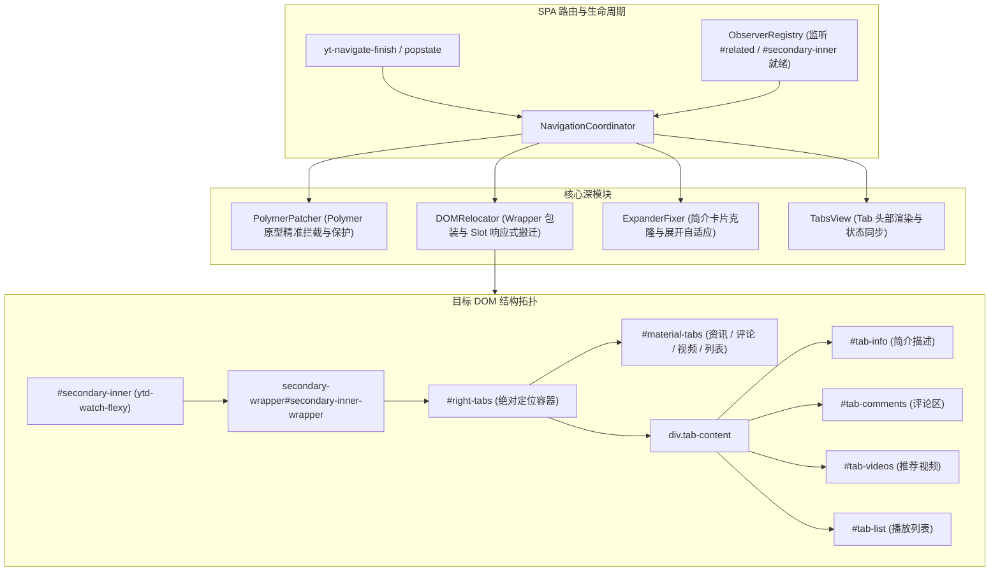

# Tabview 右侧栏修复与架构落地方案

## 1. 方案概述

Tabview 是本系统在 YouTube 桌面端视频播放页（Watch Page）的核心特性之一。其核心目标是将原生单列长流页面重构为高信息密度的多标签页结构：
- **资讯 Tab（`#tab-info`）**：展示视频详细简介、SNS 外链卡片、制作信息与互动问答，同时保持播放器下方主标题栏、作者栏与交互按钮（点赞/分享）的原位呈现。
- **评论 Tab（`#tab-comments`）**：将评论区整体迁移至右侧栏，并实时解析评论总数显示于 Tab 头部徽标。
- **视频 Tab（`#tab-videos`）**：容纳推荐视频列表与续播列表（`#related`）。
- **列表 Tab（`#tab-list`）**：若当前处于播放列表上下文，则将播放列表面板收纳于此。

本文档基于第一性原理，系统梳理当前右侧栏未呈现的技术根因，并给出完备、高内聚的模块化修复方案。

---

## 2. 第一性原理与根本原因剖析

### 2.1 异步 DOM 依赖与挂载时机断裂
- **现象**：右侧栏容器（`#right-tabs`）完全未被注入至页面 DOM 树中。
- **根因**：YouTube 为深度 SPA 应用，在路由导航或首次载入时，`<ytd-watch-flexy>` 仅作为外层占位容器先行挂载，其子树中的 `#columns`、`#secondary`、`#secondary-inner` 及推荐列表 `#related` 均由 Polymer/Lit 异步延迟渲染。原实现仅等待 `ytd-watch-flexy` 出现便立即同步执行挂载，此时 `#secondary-inner` 尚不存在，导致挂载流程静默终止且缺乏重试机制。

### 2.2 Polymer 原型（Custom Elements Prototype）反射机制失效
- **现象**：`PolymerPatcher` 拦截的方法均未被调用，原生布局逻辑在窗口缩放或路由变化时冲毁注入的 DOM 结构。
- **根因**：YouTube 的 Polymer Web Components 内部生命周期方法（如 `attached`、`detached`）以及布局调度方法（如 `updateChatLocation`、`updatePanelsLocation`、`isTwoColumnsChanged_`）并非直接绑定在标准 ES6 CustomElement 的构造函数原型上，而是位于 Polymer Controller 实例原型（即 `insp(element).constructor.prototype`）。通过 `customElements.get(tag).prototype` 获取的是空壳原型，导致原型劫持完全落空。

### 2.3 资讯 Tab（`#tab-info`）搬迁目标选择器严重错位
- **现象**：视频主信息与简介无法分离，或导致播放器下方标题区域丢失。
- **根因**：`ytd-watch-metadata` 为视频主元数据总容器（包含主标题、频道头像、订阅按钮、操作按钮区及折叠简介）。直接搬迁 `ytd-watch-metadata` 会导致视频下方区域被整体抽离。正确的机制应为：
  1. 通过在 `ytd-watch-flexy` 添加 `[hide-default-text-inline-expander]` 属性将下方默认的简介折叠块精简/隐藏；
  2. 提取或克隆 `ytd-expandable-video-description-body-renderer`（视频结构化描述主体），将其重定向并挂载至右侧栏 `#tab-info` 中。

### 2.4 `secondary-wrapper` 挂载与原生 DOM 保护隔离失效
- **现象**：右侧栏绝对定位失效或被 YouTube 原生渲染逻辑覆盖。
- **根因**：原生 `#secondary-inner` 是 YouTube 内部经常执行子节点清空与重排的区域。系统必须在 `#secondary-inner` 内插入 `<secondary-wrapper id="secondary-inner-wrapper">` 将原生节点包裹，并在原生操作期间通过 `runInProtectedContext` 动态切换 ID（外层 `secondary-inner-`，内层 `secondary-inner`），将原生操作引流至包装器内部，从而保护 `#right-tabs` 的绝对定位容器不受干扰。

### 2.5 缺少 Tab 初始状态仲裁与属性联动
- **现象**：Tab 栏未高亮激活项，内容面板保持隐藏状态。
- **根因**：`tabview.css` 依赖 `ytd-watch-flexy[tyt-tab="#tab-info"]` 等属性选择器来驱动网格与面板显隐。若未在 DOM 就绪后执行初始状态仲裁（`fixInitialTabState`），CSS 规则无法匹配，导致面板均处于隐藏状态。

---

## 3. 目标架构与数据流设计



---

## 4. 关键模块详细实现规范

### 4.1 Polymer 原型反射修正 (`src/features/tabview/page/polymer-helper.ts`)

重构 `retrieveCE` 方法，采用实例反射机制获取真实 Polymer 原型：

```typescript
export class PolymerHelper {
  public static insp(element: unknown): Record<string, any> | null {
    if (!element || typeof element !== "object") {
      return null;
    }
    const polyEl = element as Record<string, any>;
    const controller = polyEl.polymerController || polyEl.inst || polyEl;
    return typeof controller === "object" && controller !== null ? controller : null;
  }

  public static async retrieveCE(tagName: string): Promise<Record<string, any> | null> {
    if (typeof customElements === "undefined") {
      return null;
    }
    try {
      if (typeof customElements.whenDefined === "function") {
        await customElements.whenDefined(tagName);
      }
      const dummy = document.querySelector(tagName) || document.createElement(tagName);
      const inspected = this.insp(dummy);
      const ctor = inspected?.constructor;
      return ctor?.prototype ?? null;
    } catch {
      return null;
    }
  }
}
```

### 4.2 异步挂载与包装引擎 (`src/features/tabview/page/relocator.ts`)

1. **就绪检测机制**：监听 `#secondary-inner` 与 `#related` 的出现，确保只在必要节点就绪时执行挂载。
2. **安全包装构建**：
   - 创建 `<secondary-wrapper id="secondary-inner-wrapper" class="tabview-secondary-wrapper">`；
   - 将 `#secondary-inner` 的所有子节点迁移至 `secondaryWrapper`；
   - 将 `#right-tabs` 添加至 `secondaryWrapper` 顶部。
3. **Slot 搬迁规则修正**：
   - **评论区**：`ytd-comments#comments` $\rightarrow$ `#tab-comments`
   - **推荐列表**：`#related` $\rightarrow$ `#tab-videos`
   - **播放列表**：`ytd-playlist-panel-renderer` $\rightarrow$ `#tab-list`
   - **视频简介**：`ytd-expandable-video-description-body-renderer` $\rightarrow$ `#tab-info`

### 4.3 简介克隆与排版适配 (`src/features/tabview/page/expander-fixer.ts`)

1. 在 `ytd-watch-flexy` 上标记 `[hide-default-text-inline-expander]`。
2. 捕获 `ytd-expandable-video-description-body-renderer`，将结构化数据（`cnt.data`）同步至 `#tab-info` 内的专属渲染器实例。
3. 劫持并修复 `ytd-text-inline-expander` 的截断计算与行高，保证在右侧窄栏布局下的排版对齐。

### 4.4 状态仲裁与 Tab 激活联动 (`src/features/tabview/page/coordinator.ts` 与 `tabs-view.ts`)

1. **初始 Tab 决策**：
   - 默认激活 `#tab-info`（资讯）；
   - 在 `ytd-watch-flexy` 注入 `tyt-tab="#tab-info"`；
   - 若不存在播放列表，隐藏 `#tab-btn5`；
   - 若评论区存在且加载完成，更新 `#tyt-cm-count` 徽标。
2. **DOM 还原支持（Teardown）**：
   - 提供 `restoreAll()`，将迁移的 DOM 节点原位插回 Anchor 占位符；
   - 移除 `secondaryWrapper` 并还原 `#secondary-inner` 原生结构。

---

## 5. 实施文件清单与工作分解

| 文件路径 | 变更类型 | 核心变更内容 |
|---|---|---|
| `src/features/tabview/page/polymer-helper.ts` | 修改 | 重构 `retrieveCE`，基于实例反射获取 Polymer 真实原型 |
| `src/features/tabview/page/polymer-patcher.ts` | 修改 | 完善 `ytd-watch-flexy`、`ytd-comments` 等核心组件的原型保护与生命周期挂钩 |
| `src/features/tabview/page/relocator.ts` | 修改 | 重构 `mountTabsContainer`，引入异步 DOM 等待、`secondary-wrapper` 节点迁移与修正的 Slot 映射 |
| `src/features/tabview/page/expander-fixer.ts` | 修改 | 实现视频描述卡片分离与窄宽排版自适应 |
| `src/features/tabview/page/coordinator.ts` | 修改 | 完善 SPA 导航就绪 Promise 链路与初始 Tab 状态仲裁（`fixInitialTabState`） |
| `src/features/tabview/page/tabs-view.ts` | 修改 | 完善 Tab 切换事件、徽标动态刷新与字号调节绑定 |

---

## 6. 验证与质量保证计划

1. **静态检查**：
   - 运行 `pnpm run check` 确保 TypeScript 严格类型检查 0 错误、0 警告。
2. **构建产物验证**：
   - 运行 `pnpm run build` 确保 sub-bundle 编译正常，打包生成 `dist/youtube-turbo.user.js`。
3. **功能交互回归**：
   - 打开 YouTube 任意视频详情页，验证右侧栏（Tabview）正常呈现；
   - 验证视频播放器下方标题、频道作者、点赞/分享操作栏完整保留；
   - 验证“资讯”Tab 正确展示视频描述，“视频”Tab 展示推荐列表，“评论”Tab 展示评论及数字徽标；
   - 验证 Tab 间平滑切换，字号调节按钮正常工作；
   - 在剧院模式（Theater Mode）与默认视图之间切换，验证布局对齐无重叠；
   - 在主页、视频页、Shorts 之间连续路由跳转，验证无内存泄漏与无僵尸 DOM。
