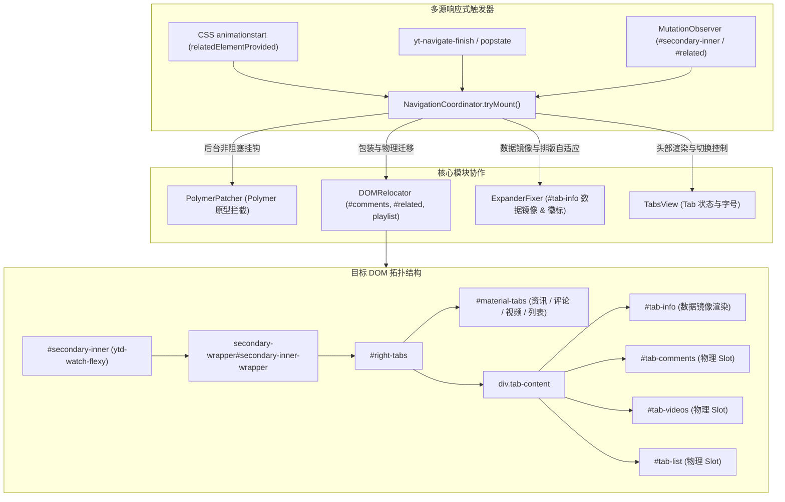

# Tabview 右侧栏修复与架构落地方案

## 1. 方案概述

Tabview 是本系统在 YouTube 桌面端视频播放页（Watch Page）的核心特性之一。其核心目标是将原生单列长流页面重构为高信息密度的多标签页结构：
- **资讯 Tab（`#tab-info`）**：展示视频详细简介、SNS 外链卡片、制作信息与互动问答，同时保持播放器下方主标题栏、作者栏与交互按钮（点赞/分享）的原位呈现。
- **评论 Tab（`#tab-comments`）**：将评论区整体迁移至右侧栏，并实时解析评论总数显示于 Tab 头部徽标。
- **视频 Tab（`#tab-videos`）**：容纳推荐视频列表与续播列表（`#related`）。
- **列表 Tab（`#tab-list`）**：若当前处于播放列表上下文，则将播放列表面板收纳于此。

本文档基于第一性原理，系统梳理右侧栏未呈现的技术根因，并给出完备、高内聚的模块化修复与重构方案。

---

## 2. 第一性原理与根本原因剖析

### 2.1 同步阻塞挂起（`await retrieveCE`）导致挂载死锁
- **现象**：右侧栏容器（`#right-tabs`）完全未被注入至页面 DOM 树中。
- **根因**：在 `mountTabview()` 前置流程中直接 `await PolymerPatcher.applyPatches()`，而其内部调用了 `await customElements.whenDefined("ytd-watch-flexy")`。在 YouTube 启动阶段，Polymer 注册往往异步延迟，该 Promise 挂起直接导致后续全部 DOM 查找与挂载逻辑被永久阻塞。
- **正解**：Polymer 原型拦截必须作为后台独立异步任务（`then` 挂钩）执行，绝不能成为 DOM 渲染与挂载的前置阻塞条件。

### 2.2 样式属性 `html[tabview-loaded="icp"]` 注入时机延迟
- **现象**：CSS 规则未生效，右侧栏布局混乱或被 YouTube 原生渲染覆盖。
- **根因**：`tabview.css` 的排版规则与关键帧动画（`@keyframes relatedElementProvided`）深度依赖 `html[tabview-loaded=icp]` 选择器。原实现在 DOM 节点查找到之后才设置该属性，导致样式未能提前就绪。
- **正解**：在沙箱 `Tabview.setup()` 阶段（`document-start`）立即设置 `document.documentElement.setAttribute("tabview-loaded", "icp")`。

### 2.3 缺乏多源响应式挂载感知机制（动画 + 路由 + Observer）
- **现象**：单次 `waitForElement` 超时后即放弃挂载，SPA 导航或冷启动时右侧栏无法恢复。
- **根因**：YouTube 推荐流与侧边栏渲染极具动态性。仅依赖单一定时器轮询极易因时序竞争导致静默失败。
- **正解**：采用“CSS `animationstart` 极速感知 + `yt-navigate-finish` 路由事件 + `MutationObserver` 周期守护”三位一体的响应式挂载机制。

### 2.4 Polymer 原型（Custom Elements Prototype）反射机制失效
- **现象**：`PolymerPatcher` 拦截的方法均未被调用，原生布局逻辑在窗口缩放或路由变化时冲毁注入的 DOM 结构。
- **根因**：YouTube Polymer Web Components 内部生命周期与调度方法位于 Polymer Controller 实例原型（即 `insp(element).constructor.prototype`），而非标准 ES6 原型。
- **正解**：通过 `insp(document.querySelector(tag) || document.createElement(tag)).constructor.prototype` 提取真实原型并动态 hook。

### 2.5 资讯 Tab（`#tab-info`）与视频主元数据解耦机制
- **现象**：视频主信息与简介无法分离，或导致播放器下方标题区域丢失。
- **根因**：`ytd-watch-metadata` 包含视频全部元数据。若直接物理搬迁 `ytd-watch-metadata` 或其内部子节点，会导致播放器下方区域被整体掏空或破坏 Polymer 虚拟 DOM 树映射。
- **正解**：
  1. 通过在 `ytd-watch-flexy` 添加 `[hide-default-text-inline-expander]` 隐藏下方默认简介，保留主标题与按钮栏；
  2. 在 `#tab-info` 内创建专属的前端镜像渲染器 `ytd-expandable-video-description-body-renderer[tyt-info-renderer]`，同步 `cnt.data` 实现数据镜像。

---

## 3. 目标架构与数据流设计

---

## 4. 关键模块详细实现规范

### 4.1 全局标记即时注入 (`src/features/tabview/index.ts`)
在脚本启动初期即注入 `[tabview-loaded="icp"]` 属性，确保 CSS 动画与布局规则在 DOM 生成前就绪。

### 4.2 非阻塞 Polymer 原型拦截 (`src/features/tabview/page/polymer-patcher.ts`)
将原型拦截由 `async/await` 阻塞模式改为后台 `Promise` 异步挂钩模式，杜绝 DOM 挂载因等待 Custom Elements 定义而挂起。

### 4.3 包装与物理 Slot 迁移 (`src/features/tabview/page/relocator.ts`)
- 将 `#secondary-inner` 的所有既有子节点安全移入 `<secondary-wrapper id="secondary-inner-wrapper">`；
- 在包装器首部挂载 `#right-tabs`；
- 物理 Slot 仅管理 `#tab-comments`、`#tab-videos` 与 `#tab-list`。

### 4.4 简介数据镜像与排版自适应 (`src/features/tabview/page/expander-fixer.ts`)
- 捕获 `ytd-expandable-video-description-body-renderer`，将 `data` 同步至 `#tab-info` 中的镜像节点；
- 劫持 `ytd-text-inline-expander` 调用 `resize(false)` 与 `updateStyles()` 保证窄栏对齐；
- 监听并解析 `ytd-comments-header-renderer` 评论总数更新 `#tyt-cm-count`。

### 4.5 状态仲裁与生命周期调度 (`src/features/tabview/page/coordinator.ts`)
- 集成动画感知、SPA 导航与 MutationObserver 兜底；
- `fixInitialTabState` 统一仲裁激活默认 Tab、设置属性联动并隐藏空播放列表 Tab。

---

## 5. 验证与质量保证计划

1. **静态类型检查**：`pnpm run check` $\rightarrow$ **0 错误、0 警告**。
2. **生产构建打包**：`pnpm run build` $\rightarrow$ 顺利生成 `dist/youtube-turbo.user.js`。
3. **页面功能回归**：
   - 视频详情页右侧栏多标签正常渲染呈现；
   - 播放器下方主标题栏、作者栏与操作按钮完整保留；
   - 资讯、评论、推荐视频与播放列表 Tab 内容独立对齐；
   - 字号调节与评论徽标响应实时准确。
