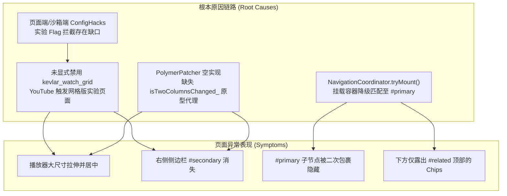
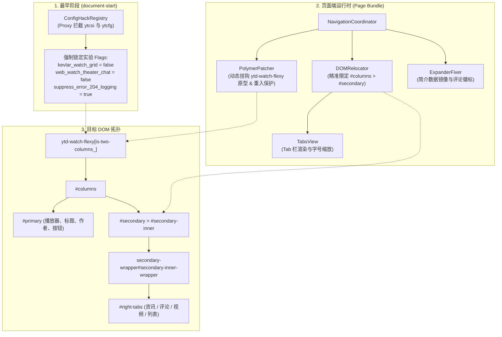

# YouTube 播放页双列布局与侧边栏显示修复方案

## 1. 方案概述

本方案旨在系统性解决 YouTube 桌面端视频播放页（Watch Page）中出现的“侧边栏不显示、视频播放器拉伸居中、下方仅残留部分推荐视频筛选 Chips 且视频主信息丢失”等布局异常问题。

通过从底层 DOM 拓扑、YouTube Polymer 响应式双列（Two-Column）计算逻辑及 InnerTube 实验参数（Experiment Flags）的第一性原理出发，构建完备且高内聚的修复体系，确保播放页稳定呈现左侧播放器/视频主信息区与右侧多 Tab 侧边栏的经典高效率布局。

---

## 2. 第一性原理与根本原因剖析



### 2.1 YouTube `kevlar_watch_grid` 实验性重构触发单列网格布局
- **机制原理**：YouTube 官方针对部分用户灰度推送 `kevlar_watch_grid` 播放页网格架构实验。启用后：
  1. 页面将双列布局重构为单列大视口模式，视频播放器被强制拉伸并居中；
  2. 原属于右侧侧边栏的推荐视频流（`#related`）被下移至播放器下方；
  3. 原有的 `#secondary` / `#secondary-inner` 侧边栏结构被排空或隐藏。
- **根因定位**：在 [`src/core/config-hacks.ts`](file:///e:/project/YouTube_Improvements/src/core/config-hacks.ts) 中，`applyDefaultFlags` 仅配置了部分 ShadyDOM 选项，遗漏了 `kevlar_watch_grid = false` 与 `web_watch_theater_chat = false`，导致 YouTube 原生实验被判定为开启。

### 2.2 `NavigationCoordinator` 挂载容器降级匹配错位
- **机制原理**：在 [`src/features/tabview/page/coordinator.ts`](file:///e:/project/YouTube_Improvements/src/features/tabview/page/coordinator.ts) 的 `tryMount()` 流程中，当在 DOM 中未能找到标准 `#secondary-inner` 时，执行了模糊降级选择器：
  ```typescript
  const secondaryInner =
    document.querySelector<HTMLElement>(PAGE_CONSTANTS.SELECTORS.SECONDARY_INNER) ||
    document.querySelector<HTMLElement>("#secondary-inner") ||
    document.querySelector<HTMLElement>("#secondary") ||
    document.querySelector<HTMLElement>("#related")?.parentElement;
  ```
- **根因定位**：在网格实验生效时，`#related` 位于主区域 `#primary` 内，该降级逻辑错误地将 `#primary` 判定为侧边栏容器，为其包裹了 `secondary-wrapper`。由于 `secondary-wrapper` 具有 `position: absolute; right: 0; contain: size style;` 等样式约束，直接导致播放器下方的视频标题、频道信息、展开简介等全部被样式抑制隐藏，主区仅留下顶部 Chips 节点。

### 2.3 Polymer `ytd-watch-flexy` 双列计算与原型代理缺失
- **机制原理**：YouTube 播放页依赖 `ytd-watch-flexy` 的 Polymer Controller 动态执行 `isTwoColumnsChanged_()`、`updatePlayerLocation()`、`updatePanelsLocation()` 与 `updatePageMediaQueries()` 等方法来计算视口并设置 `[is-two-columns_]` 属性。
- **根因定位**：在 [`src/features/tabview/page/polymer-patcher.ts`](file:///e:/project/YouTube_Improvements/src/features/tabview/page/polymer-patcher.ts) 中，所有原型拦截均为空实现，未注入 `secondaryInnerFn` 上下文保护（临时映射 `#secondary-inner` ID 至 `secondary-wrapper`），导致 YouTube 布局计算无法正确识别已被重构的侧边栏 DOM 结构，进而移除 `is-two-columns_` 属性，退化为纵向单列排版。

---

## 3. 目标系统架构与数据流设计



---

## 4. 关键模块修复实现规范

### 4.1 实验 Flag 拦截增强 ([`src/core/config-hacks.ts`](file:///e:/project/YouTube_Improvements/src/core/config-hacks.ts))
在 `applyDefaultFlags` 中补充所有影响播放页布局的实验控制项，确保在 YouTube 脚本初次读取时即锁定经典布局参数：

```typescript
function applyDefaultFlags(config: YTConfigObject): void {
  const flagsToDisable: ReadonlyArray<string> = [
    "kevlar_watch_grid",
    "web_watch_theater_chat",
    "web_watch_chat_hide_button_killswitch",
    "enable_shadydom_free_scoped_node_methods",
    "enable_shadydom_free_scoped_query_methods",
    "enable_shadydom_free_scoped_readonly_properties_batch_one",
    "enable_shadydom_free_parent_node",
    "enable_shadydom_free_children",
    "enable_shadydom_free_last_child"
  ];

  const targets = [config.EXPERIMENT_FLAGS, config.EXPERIMENTS_FORCED_FLAGS];
  for (const flagTarget of targets) {
    if (flagTarget && typeof flagTarget === "object") {
      flagTarget.suppress_error_204_logging = true;
      for (const flag of flagsToDisable) {
        flagTarget[flag] = false;
      }
    }
  }
}
```

### 4.2 容器定位安全边界与常量收敛 ([`src/features/tabview/page/coordinator.ts`](file:///e:/project/YouTube_Improvements/src/features/tabview/page/coordinator.ts))
修正 `tryMount()` 中的容器查找逻辑，严格限定侧边栏容器必须为 `#columns > #secondary` 范围内的节点，彻底剔除模糊匹配与错误的 `#primary` 降级分支，相关选择器统一收敛至 [`src/features/tabview/page/constants.ts`](file:///e:/project/YouTube_Improvements/src/features/tabview/page/constants.ts)：

```typescript
// PAGE_CONSTANTS.SELECTORS 新增常量
export const PAGE_CONSTANTS = {
  SELECTORS: {
    // ...
    SECONDARY_INNER_EXACT: "#columns.ytd-watch-flexy > #secondary.ytd-watch-flexy > #secondary-inner, #secondary.ytd-watch-flexy > #secondary-inner, #secondary-inner.style-scope.ytd-watch-flexy",
    SECONDARY_WRAPPER_EXACT: "#secondary-inner.style-scope.ytd-watch-flexy > secondary-wrapper",
  }
};
```

`NavigationCoordinator.tryMount()` 精准挂载逻辑：

```typescript
public tryMount(): void {
  if (this.isMounting || !this.localeSnapshot) {
    return;
  }

  const secondaryInner = document.querySelector<HTMLElement>(PAGE_CONSTANTS.SELECTORS.SECONDARY_INNER_EXACT);
  if (!secondaryInner) {
    return;
  }

  const flexy = document.querySelector<HTMLElement>(PAGE_CONSTANTS.SELECTORS.YTD_WATCH_FLEXY);

  this.isMounting = true;
  try {
    if (flexy) {
      this.polymerPatcher.patchFlexyInstance(flexy);
      flexy.setAttribute(PAGE_CONSTANTS.ATTRIBUTES.HIDE_DEFAULT_TEXT_INLINE_EXPANDER, "");
    }

    document.documentElement.setAttribute(
      PAGE_CONSTANTS.ATTRIBUTES.TABVIEW_LOADED,
      PAGE_CONSTANTS.VALUES.TABVIEW_LOADED_ICP
    );

    this.relocator.mountTabsContainer(secondaryInner, {
      localeSnapshot: this.localeSnapshot,
      onTabSelected: (tabKey) => {
        this.onTabChangedCallback?.(tabKey);
        this.expanderFixer?.fixExpanders();
      },
      onFontSizeChanged: (tabKey, delta) => {
        this.onFontSizeChangedCallback?.(tabKey, delta);
      }
    });

    this.relocator.registerDefaultSlots();
    this.relocator.refreshAllSlots();

    if (!this.expanderFixer) {
      this.expanderFixer = new ExpanderFixer(this.relocator.getTabsView());
    }
    this.expanderFixer.init();

    if (flexy) {
      this.fixInitialTabState(flexy);
    }
    this.observerRegistry.activate();
  } finally {
    this.isMounting = false;
  }
}
```

### 4.3 Polymer 原型拦截与安全执行沙盒 ([`src/features/tabview/page/polymer-patcher.ts`](file:///e:/project/YouTube_Improvements/src/features/tabview/page/polymer-patcher.ts))
深度对齐原脚本 `tampermonkey.original.user.js` 中 `ytd-watch-flexy::defined` 与 `secondaryInnerFn` 的实现机制：
1. **重入保护 (`secondaryInnerHold`)**：使用深度计数器，避免嵌套调用时 ID 错乱；
2. **实例 `this` 上下文无损透传**：采用标准函数保留原型实例 `this` 调用链；
3. **严格 TypeScript 类型契约**：杜绝隐式 `any`；
4. **生命周期可逆还原 (`restorePatches`)**：缓存原生方法引用，支持热卸载。

```typescript
export interface PolymerElementInstance extends HTMLElement {
  polymerController?: Record<string, unknown>;
  inst?: Record<string, unknown>;
}

export type AnyFunction = (...args: unknown[]) => unknown;

export class PolymerPatcher {
  private static instance: PolymerPatcher | null = null;
  private isPatched: boolean = false;
  private protectionDepth: number = 0;
  private originalMethods: Map<string, AnyFunction> = new Map();
  private targetPrototype: Record<string, unknown> | null = null;

  public static getInstance(): PolymerPatcher {
    if (!PolymerPatcher.instance) {
      PolymerPatcher.instance = new PolymerPatcher();
    }
    return PolymerPatcher.instance;
  }

  public runInProtectedContext<R>(callback: () => R): R {
    if (this.protectionDepth > 0) {
      this.protectionDepth++;
      try {
        return callback();
      } finally {
        this.protectionDepth--;
      }
    }

    const ea = document.querySelector<HTMLElement>("#secondary-inner");
    const eb = document.querySelector<HTMLElement>("secondary-wrapper#secondary-inner-wrapper");
    if (ea && eb) {
      this.protectionDepth++;
      ea.id = "secondary-inner-";
      eb.id = "secondary-inner";
      try {
        return callback();
      } finally {
        ea.id = "secondary-inner";
        eb.id = "secondary-inner-wrapper";
        this.protectionDepth--;
      }
    }

    return callback();
  }

  public applyPatches(): void {
    if (this.isPatched) {
      return;
    }
    this.isPatched = true;

    if (typeof customElements !== "undefined") {
      customElements
        .whenDefined("ytd-watch-flexy")
        .then(() => {
          const dummy = (document.querySelector("ytd-watch-flexy") ||
            document.createElement("ytd-watch-flexy")) as PolymerElementInstance;
          const cnt = dummy.polymerController || dummy.inst || dummy;
          const proto = Object.getPrototypeOf(cnt) as Record<string, unknown> | null;
          if (!proto) {
            return;
          }

          this.targetPrototype = proto;
          const methodsToWrap: ReadonlyArray<string> = [
            "updatePlayerLocation",
            "updateChatLocation",
            "updatePanelsLocation",
            "isTwoColumnsChanged_",
            "defaultTwoColumnLayoutChanged",
            "updateCinematicsLocation",
            "swatcherooUpdatePanelsLocation",
            "updateErrorScreenLocation",
            "updateFullBleedElementLocations"
          ];

          const patcher = this;
          for (const method of methodsToWrap) {
            const rawMethod = proto[method];
            if (typeof rawMethod === "function" && !this.originalMethods.has(method)) {
              this.originalMethods.set(method, rawMethod as AnyFunction);
              proto[method] = function (this: unknown, ...args: unknown[]): unknown {
                return patcher.runInProtectedContext(() => {
                  return (rawMethod as AnyFunction).apply(this, args);
                });
              };
            }
          }
        })
        .catch((err: unknown) => {
          console.warn("[PolymerPatcher] Failed to patch custom elements:", err);
        });
    }
  }

  public restorePatches(): void {
    if (this.targetPrototype && this.originalMethods.size > 0) {
      for (const [method, rawMethod] of this.originalMethods.entries()) {
        this.targetPrototype[method] = rawMethod;
      }
      this.originalMethods.clear();
      this.targetPrototype = null;
    }
    this.isPatched = false;
    this.protectionDepth = 0;
  }

  public patchFlexyInstance(_element: HTMLElement): void {
    this.applyPatches();
  }
}
```

---

## 5. 验证与质量保证计划

### 5.1 自动化编译与静态检查
```powershell
# 1. 严格模式类型检查（严禁隐式 any 与类型错误）
pnpm run check

# 2. 生产打包构建（验证 Sub-bundle 虚拟模块内联与产物完整性）
pnpm run build
```

### 5.2 浏览器端功能与布局验证矩阵

| 验证项 | 测试场景与操作 | 预期结果 |
|---|---|---|
| **双列布局初始化** | 冷启动打开任意普通视频播放页 | 播放器位于左侧，右侧稳定呈现 Tab 栏（资讯/评论/视频），无全宽拉伸居中异常。 |
| **视频主信息完整性** | 检查播放器下方 `#below` 区域 | 视频标题、发布者头像/名称、订阅按钮、点赞/分享等操作栏完整可见，未被包裹隐藏。 |
| **Tab 切换与 Slot 迁移** | 依次点击【评论】、【视频】、【资讯】Tab | 对应内容平滑切换，评论总数徽标精准同步，无抖动或重叠。 |
| **SPA 路由连续跳转** | 视频页 $\rightarrow$ 首页 $\rightarrow$ 频道页 $\rightarrow$ 另一视频页 | 路由切换自如，观察者按需注销与重新激活，无内存泄漏与僵尸节点。 |
| **剧场模式自适应** | 点击播放器控制栏【剧场模式】按钮 | 播放器置顶全宽展示，侧边栏与主信息流自适应流动排列于播放器下方，排版正常。 |
